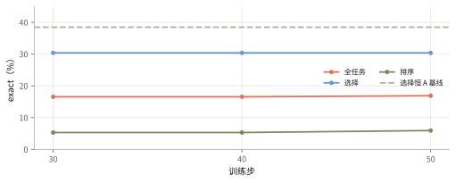
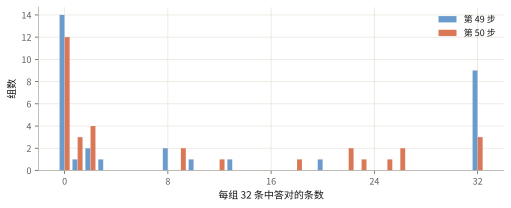

# Flash-Next 已有稳定更新信号，能力提升还未证实

同一测试集上，第 30、40、50 步分别答对 96、96、98 条；训练组仍有奖励差异，净增两条不足以确认模型学会了更多。

<ul class="settings"><li>模型 <b>Flash-Next MoE</b></li><li>权重 / 激活 <b>4bit / 16bit</b></li><li>更新 <b>LoRA adapter</b></li><li>评测 <b>290 题 × 2 次</b></li><li>每题生成 <b>32 次</b></li></ul>

## 量化基座上只更新少量 adapter 参数

MoE（混合专家模型）把计算分配给部分专家。实验将基座权重存为 4bit、激活用 16bit，称为 W4A16；LoRA 是附加在基座上的低秩可训练参数。本文只使用原 W4A16 生产线的学习证据，原生 INT4 和 prefetch 性能候选各有独立测试。

模型接受与 0.8B 主线相同的 290 题测试：130 道选择题、160 道排序题，每题两次，temperature=1、top_p=1、16k 上限。三次评测记录的数据、tokenizer、reward 与采样协议一致，仅 adapter 改变。本文已核验的记录未包含完整训练题池 manifest，因此不把其他实验线的 6,153 题规模直接填给本线。

训练每步有 32 个真实组、每组 32 条回答，共 1,024 条。组内相对奖励提供更新信号，KL reference 约束策略偏移。选择奖励和排序部分分使用已保存的 thinking 评分器。训练入口为 <code>fn_train</code>（原 W4A16 的训练前向实现），没有共享题目前缀；保存的是 adapter-only checkpoint，不含 optimizer、随机数或 rollout 队列状态。

## 三次测试几乎没有净变化

| 训练步 | 全任务 exact | 选择 exact | 排序 exact |
|---|---:|---:|---:|
| 30 | 96/580（16.55%） | 79/260（30.38%） | 17/320（5.31%） |
| 40 | 96/580（16.55%） | 79/260（30.38%） | 17/320（5.31%） |
| 50 | 98/580（16.90%） | 79/260（30.38%） | 19/320（5.94%） |

第 40→50 步有 25 条变对、23 条变错，净增 2/580（0.34 个百分点）。选择题 30.38% 仍低于该切片恒选 A 的 38.46%。第 50 步全部自然结束，无截断或解析失败；第 30 步有一条排序无法解析。缺少零步评测，不能据这三个点判断相对训练起点的变化。

## 真实训练组仍能产生 advantage

| 指标 | 第 49 步 | 第 50 步 |
|---|---:|---:|
| 组正确率均值 / 跨组 std | 34.67% / 43.12 个百分点 | 29.20% / 36.65 个百分点 |
| 零正确 / 部分正确 / 全对组 | 14 / 9 / 9 | 12 / 17 / 3 |
| 奖励有差异 / 零方差组 | 20 / 12 | 24 / 8 |
| 按 advantage 符号计的 sequence clip | 1.56% | 1.17% |
| reference KL | 0.001751 | 0.001753 |

零正确组也可能因排序部分分不同而有 advantage。第 43–50 步的有效奖励组为 18–24/32，未持续归零。训练梯度非零、clip 和 KL 有限，支持管线仍有信号，尚不足以确认能力改善。

## 这条路径的大部分时间用于前反向

Infra 让 rollout 与训练异步重叠，但 trainer 对每条回答重算题目前缀。第 49、50 步每步训练前向约 604、606 万 token。

| 阶段（秒） | 第 49 步 | 第 50 步 |
|---|---:|---:|
| 整步 | 1,770.92 | 1,734.62 |
| 前反向 | 1,769.32 | 1,732.99 |
| 其中 reference | 320.91 | 315.86 |
| 等待 rollout | 0.35 | 0.36 |
| optimizer / adapter 同步 | 0.05 / 0.88 | 0.07 / 0.88 |

reference 已计入前反向；异步 rollout 的 1,372、1,276 秒不再加到整步。吞吐为 0.578、0.590 samples/s，MFU 未测量。这是原生产路径的计时，不能代表后续原生 INT4 或共享前缀候选的性能。

## science 仍需要独立的学习证据

science 在这里要求条件敏感的判断、可靠解释和新实例迁移。本线尚未确认任务成绩上升，也未完成条件反转、等价改写和新实例测试。训练 token 已保存，但健康记录的文本摘要为空，本文未完成语义解码 review。

当前结论是量化 MoE 的 RL 更新与评测管线可运行，奖励差异仍存在。它还不能证明 science 的形成；性能探针和外部模型经工具发现的机制，均不能算作这个 policy 已学会的知识。

来源：原 W4A16 第 49–50 步健康记录及第 30/40/50 步评测；[指标与逐组分布](aiq-rl-flash-next-2026-10-06-data.json)。证据截止于第 50 步。
