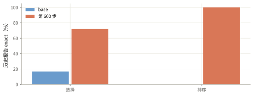

# 早期 RL 把排序题做对了，但数据捷径削弱了结论

0.8B 模型在旧测试集上达到 72% 的选择正确率和接近 100% 的排序正确率；排序答案存在可记忆的 loss 签名，现有证据不足以证明模型学会了可迁移的科学规律。

<ul class="settings"><li>模型 <b>Qwen3.5-0.8B base</b></li><li>数据 <b>旧混合题池</b></li><li>评测 <b>300 题 × 2 次</b></li><li>训练 <b>GRPO → GSPO</b></li></ul>

## 旧排序题主要考察 loss 之间的次序

ArchitectureIQ 让模型在训练之前，预测几个训练配置中谁的测试成绩更好。选择题有三个候选；排序题要求排列五个候选。正确答案来自候选模型的实际训练结果。

早期混合池包含 2,000 道 <code>loss_ranked</code>（以 loss 为主要变化项的排序题），标准次序可以由 loss 组合的签名近似恢复。这里的“签名”指候选配置里的 loss 名称及其组合。训练池有过 2,134 题和 3,000 题两种版本，不能视为同一固定数据集。300 题测试切片包含 200 道选择题和 100 道排序题；它与后来的 290 题主线测试集不同。

## 截断惩罚先改变了模型的回答方式

实验从未做监督微调的 base 模型开始，先用 GRPO，再用 GSPO（按整条回答的平均概率比更新策略）。回答打满上限扣 2 分，不可解析扣 0.5 分；选择正确得 1 分，错误得 0 分。排序部分的评分经历过调整，本线的奖励不能与后续主线合并比较。

异步训练把 rollout（生成候选回答）和参数更新放在两组 GPU 上，生成与训练重叠。历史记录描述：前约 200 步，平均回答从约一万 token 缩到约 16 token，截断比例从 67% 降到接近零。可解析的短答案更容易获得正奖励，这能解释回答方式的改变。

## 第 600 步的成绩很高，但排序任务存在捷径

| 历史报告值 | base | 第 600 步 |
|---|---:|---:|
| 选择 exact | 16.75% | 72.00% |
| 排序 exact | 0% | 100% |

数值来自 9 月 30 日机制报告，未在本文重新评分。base 的不可解析样本较多，因此选择题的差值同时包含格式修复和判断变化。第 400 步的排序成绩已约为 99%；此后继续观察同一测试集，无法把第 600 步当作独立确认。

## 胜过粗规则仍不足以证明 science

本文把 science 理解为：模型能依据数据条件调整判断，并把规律迁移到新实例，经干预测试后仍成立。旧报告曾用任务类型上的多数规则作对照：29 道规则答错的排序题，模型全部答对。这说明模型超过了这个粗对照；更细的 loss 签名仍可能提供捷径。

旧报告据此提出的“程序学习”“泛化先于记忆”应保留为假说。要求 base 直接作答、置换选项、交换代码块和测试未见任务类型的消融没有完成结果。后续主线剔除了 <code>loss_ranked</code> 来源，以条件反转题和新排序题重新检验。当前可以确认回答格式和任务成绩改变，尚不能确认可迁移的科学知识。

来源：2026-09-30 机制报告、2026-10-06 综合复核；[数据与来源索引](aiq-rl-loss-ranking-2026-10-06-data.json)。证据截止于这些历史记录。
