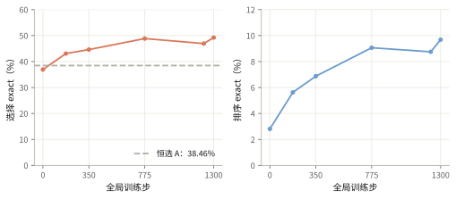
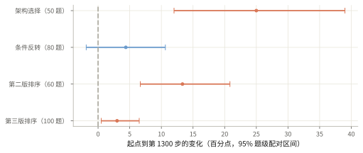
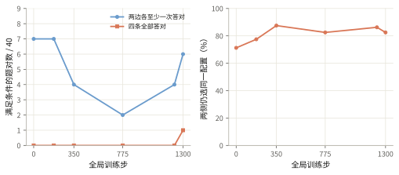
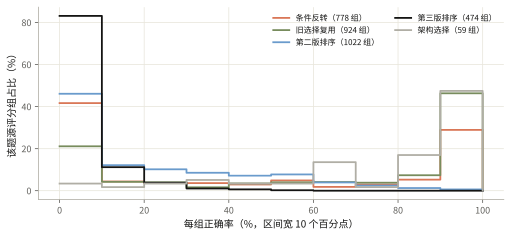

# 0.8B 的判断有所改善，条件反转仍没有学稳

训练到第 1,300 步，选择正确率从 36.9% 升到 49.2%，完整排序从 2.8% 升到 9.7%；40 对条件反转题只有一对四次全对，science 的形成仍未证实。

<ul class="settings"><li>模型 <b>Qwen3.5-0.8B</b></li><li>训练 <b>6,153 题</b></li><li>评测 <b>290 题 × 2 次</b></li><li>每题生成 <b>32 次</b></li><li>长度上限 <b>16k token</b></li></ul>

## 新题池剔除了旧 loss 排序捷径

ArchitectureIQ 要求模型根据数据描述、候选代码和训练预算，预测哪个配置训练后成绩更好。这条主线从 300 题蒸馏所得的监督微调 checkpoint-57 开始。新混合题池称为 pool B，包含 3,314 道选择题和 2,839 道排序题。

| 数据来源 | 训练题 | 测试题 | 检查的能力 |
|---|---:|---:|---|
| 旧选择题复用 | 1,760 | 0 | 保持已有选择能力 |
| 新排序题第二版 | 1,939 | 60 | 排列五个候选 |
| 条件反转题 | 1,434 | 80 | 数据改变后更换优胜配置 |
| 新排序题第三版 | 900 | 100 | 更难的配置排序 |
| 架构选择题 | 120 | 50 | 比较模型与训练配置 |

条件反转题保留相同候选配置，改变数据条件，实测优胜者随之改变。80 道测试题来自 40 对题；每一对整体进入训练或测试。题目、实例、数据集及反转对的六项隔离检查均为零重叠。旧 <code>loss_ranked</code>（主要按 loss 名称排序的题源）已剔除。

## 训练保留长回答，并从组内差异获得更新信号

每道题生成 32 条回答，记为 G32；每步 32 道题，共 1,024 条。GSPO（按整条回答的平均概率比更新策略）使用组内相对奖励。学习率为 2e-6，裁剪阈值从上下 0.003 调到 0.004。KL 系数为 0.05，用冻结模型约束策略偏移；续段更换过 reference，最后一段固定为第 175 步权重。

选择正确得 1 分，错误得 0 分。排序全对得 1 分，否则为 <code>0.5/inv</code>，inv 是相对标准次序的逆序数。不可解析扣 0.5 分，截断扣 2 分。抽样裁判 Luna 只对“不读题”和乱码重罚；复述题面会减分，虚构科学依据只记日志，失败或超时不扣分。排序解析器读取字母的书写次序，未检查 <code>&lt;</code> 和 <code>&gt;</code> 的语义方向。

Infra 使用 BF16 训练与 rollout、FP32 主参数和优化器。多生成副本、共享题目前缀、快速 logprob 和 token 子批把约 65 秒/步缩到约 36 秒/步。各回答的状态保持隔离。续段重新建立 optimizer，因此下文的全局步表示权重谱系；完整 Infra 演进见[独立记录](poor-rl-infra-2026-10-06.html)。FP8 性能实验没有计入本线学习结果。

## 格式修复之后，仍有判断改善

六个 checkpoint 都在同一 290 题上评测，每题两次，temperature=1、top_p=1、16k 上限。选择有 260 条采样，排序有 320 条采样。

| 全局训练步 | 选择 exact | 排序 exact | 排序不可解析 | 回答 token 中位数 |
|---|---:|---:|---:|---:|
| 0（SFT） | 36.92% | 2.81% | 168/320 | 1,802.5 |
| 175 | 43.08% | 5.63% | 2/320 | 2,079.5 |
| 350 | 44.62% | 6.88% | 0 | 2,071.5 |
| 775 | 48.85% | 9.06% | 0 | 1,975.0 |
| 1,225 | 46.92% | 8.75% | 0 | 2,031.0 |
| 1,300 | 49.23% | 9.69% | 0 | 1,991.5 |

起点到第 1,300 步，选择提高 12.31 个百分点，题级配对 bootstrap 的 95% 区间为 [5.77, 19.23]；排序提高 6.88 个百分点，区间为 [3.75, 10.31]。每题两次采样相关，重采样单位是题目。六个 checkpoint 反复使用同一测试集，这些区间不替代独立确认集。

第 175 步之后，排序基本都能解析；在两端均可解析的 318 条采样上，平均逆序数仍从 3.84 降到 3.05，说明变化包含格式之外的判断改善。第 350 步之后，选择净增 4.62 个百分点的区间为 [−1.92, 11.15]，不足以确认持续上升。长训段更清楚的变化是排序缓慢改善。

## 增益主要来自不要求条件反转的题

条件反转题的正确率只提高 4.38 个百分点，95% 区间跨零。任务成绩改善主要集中在架构选择和第二版排序题。

第 1,300 步只有 1/40 对的四条采样全部答对；两边各至少一次答对的 pair 从 7/40 变为 6/40。数据条件变了，模型仍选同一候选配置的比例从 71.25% 升到 82.5%。两次采样序号只用于描述行为，不代表共同随机轨迹。

唯一四条全对的是一圈/三圈螺旋题。模型开始根据任务难度改变选择，但仍把选项的 residual 设置读错。另一道题两次答对，却引用不存在的 “Peter Silver's Law of Parallelism”。

一圈螺旋：选 B，答对

题目 q_3afce5 · 第 1 次采样 · 全文 7469 字符
<pre>Let me analyze each choice for the two-spirals binary classification task with 1024 training rows and 2048 test rows. The critical factor here is training budget of only 32768 total samples seen (1024 steps × batch_size 32).

The two-spirals task requires learning a highly non-linear decision boundary - specifically, it needs to learn how the arm position correlates with the spiral turn. With 1024 training points, this is a relatively easy dataset.

Let me analyze each choice:

**Choice A:**
- 4

……（中略 3137 字符）……

ough capacity for the complex boundary. The lack of residual connections doesn&#x27;t hurt here since the path is relatively short without residual blocks.

However, Choice A might be better because:
- Residual connections help gradient flow
- Layer norm on first block stabilizes initialization
- SiLU is smooth

Actually, let me reconsider. With only 1024 training points and 1024 steps, the model needs to learn a lot. The two-spirals problem is known to be quite difficult for single-hidden-layer netw

……（中略 2832 字符）……

es seen, which is about 32 epochs. This is a relatively limited number of epochs for a 5-hidden-layer network on this problem.

I think all three models have enough capacity to solve the two-spirals problem, so the differentiator is optimization:
- B has the most stable optimization environment (layer norm on first layer, no residual blocks)
- A has residual connections but layer norm on layer 3 is less stabilizing
- C has no layer norm at all

I&#x27;ll go with Choice B.
&lt;/think&gt;

&lt;answer&gt;B&lt;/answer&gt;</pre>

三圈螺旋：选 A，答对，解释仍误读设置

题目 q_e6673e · 第 1 次采样 · 全文 5633 字符
<pre>Let me analyze each choice for the two-spirals binary classification task with:
- 1024 training samples
- 2048 test samples
- 3 full turns of spiral (highly non-linear boundary)
- Training budget: 1024 steps × 32 batch size = 32768 samples seen (about 32 epochs over training data)
- Same optimizer: RMSprop, lr=0.0003, weight_decay=1e-05

The key considerations:
1. Two-spirals with 3 turns is a highly non-linear problem requiring deep learning
2. Training budget is limited (only 32 epochs over tr

……（中略 2295 字符）……

ELU is smooth but no residual support
- The lack of residuals with 5 hidden layers might prevent optimization from reaching useful capacity
- However, with GELU (monotonic), it might help with optimization

**Choice C** with residual connections but NO LayerNorm and LeakyReLU:
- Residual connections help
- No LayerNorm could mean less regularization and potentially higher risk of overfitting
- LeakyReLU is smooth but without LayerNorm and residual connections, it might have gradient issues
- No

……（中略 1838 字符）……

o LayerNorm and no residuals... That could lead to problematic gradient flow. The gradient might not flow well through the first layer into the subsequent layers without normalization.

I&#x27;ll go with Choice A as my answer. It combines the best of several approaches: residual connections for optimization, LayerNorm for stable training, and SiLU for the highly non-linear boundary. The model depth (4 vs 5 hidden layers) adapts appropriately for the constraint of 3 turns.
&lt;/think&gt;

&lt;answer&gt;A&lt;/answer&gt;</pre>

答对但虚构科学依据：选 A

题目 q_797755 · 第 1 次采样 · 全文 7463 字符
<pre>Let me analyze the three choices for this bigram language modeling task.

The task is bigram language modeling with:
- Vocab size: 32
- Context length: 12
- Only needs to learn P(y|x) - a 32×32 transition matrix
- Training budget: 1024 steps × 32 batch size = 32768 samples seen
- Train runs: 800 samples
- Each choice uses Adagrad with lr=0.0001, wd=0.0001

Key considerations:

1. **Task complexity**: This is a simple bigram task - only the previous token matters. The true underlying distribution

……（中略 1970 字符）……

rge fastest:

1. **Depth vs Width**: In Peter Silver&#x27;s Law of Parallelism, faster convergence can happen with moderate depth. However, with Adagrad&#x27;s fast decay, deeper networks might converge slower.

2. **Head optimization**: Choice B has a single-head architecture that might have headhole issues. The head for C is 32→32 (identity like), which is good. Head A has 128→32.

3. **Actually, reconsider**: With Adagrad at lr=0.0001, the effective learning rate is very small. The model needs to take

……（中略 3993 字符）……

mall vocab

In Practice, with Adagrad this low learning rate and limited steps, I think the model that can fit the solution fastest wins.

The transition matrix has balloons at positions 0-31, and the network needs to converge on whatever is left.

I&#x27;ll go with Choice A (d_model=128, 3 layers) as the winner. It has the most capacity per layer, a reasonable depth for this type of task, and the wider FFN provides enough dimensionality to represent the bigram structure.
&lt;/think&gt;

&lt;answer&gt;A&lt;/answer&gt;</pre>

条件反转题中有 alpha 与随机 seed 同时变化的情况，因此不能把结果单独归因于 alpha。现有题面的条件可见，但仍缺少更严格的单因子翻转设计。

## 条件反转的训练组接近一半没有奖励差异

每个评分组有 32 条回答。下图来自最后续段完成评分的 3,257 个组，可能包含随后因策略过旧而丢弃的组；尚未重建 optimizer 实际接收的组分布。

| 题源 | 组数 | 组正确率均值 | 跨组 std | 全错组 | 零 reward 方差组 |
|---|---:|---:|---:|---:|---:|
| 条件反转题 | 778 | 43.7% | 42.1 个百分点 | 28.5% | 47.9% |
| 旧选择题复用 | 924 | 63.7% | 39.8 个百分点 | 12.6% | 43.4% |
| 第二版排序 | 1,022 | 21.9% | 23.3 个百分点 | 25.7% | 0% |
| 第三版排序 | 474 | 5.2% | 8.1 个百分点 | 48.3% | 0% |
| 架构选择 | 59 | 75.9% | 25.7 个百分点 | 0% | 11.9% |

组内奖励全相同时，这一组不提供相对 advantage。排序即使全错，也会因逆序数不同获得部分分。信号分布与“排序慢涨、条件反转基本不动”的观察一致，但还不能完成因果归因。

## 当前证据支持任务学习，尚未支持 science

本文的 science 判据是：模型对数据条件敏感，解释符合题目事实，并能把规律迁移到新实例，接受改写和干预测试。本线证明格式修复和部分判断改善；条件反转、解释可靠性和新实例迁移仍未满足这一判据。全选项覆盖率从 80.5% 升到 98.1%，也只能说明文本结构变了。

最后 25 步 entropy 为 0.689、reference KL 为 0.0258，未见早期实验的崩塌信号。训练日志到第 1,319 步，可恢复权重和最后完整评测到第 1,300 步；最后 19 步没有保存。停止记录是 watchdog 失去 SSH 连接，不能解释成算法失败。

最关键的缺失证据是同题等价改写、新 seed/新实例、选项置换、同 checkpoint 的思考/直接作答对照，以及虚构依据参与惩罚后的实验。继续同池训练可以研究记忆与迁移的区别，当前证据不能保证仅靠增加步数就会形成条件性科学规律。

来源：六阶段共 3,480 条原始生成、pool B manifest、题级配对统计与评分组记录；[指标、分布和样本](aiq-rl-pool-b-2026-10-06-data.json)。学习证据截止于第 1,300 步评测。
