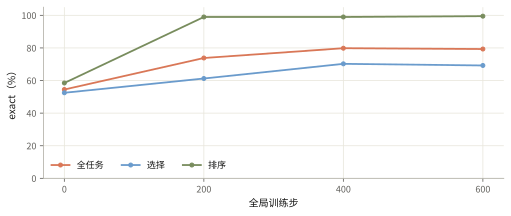
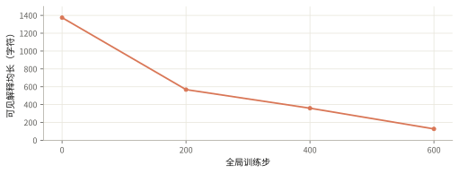

# 0.8B 的成绩上涨，解释却逐步失去题目依据

0.8B 模型的测试成绩从 54.5% 升到 79.8%，同期可见解释缩短并出现虚构术语；正确答案和可靠解释没有同步改善。

<ul class="settings"><li>起点 <b>0.8B 监督微调模型</b></li><li>训练 <b>3,830 题</b></li><li>评测 <b>300 题 × 2 次</b></li><li>长度上限 <b>训练 2k / 评测 16k</b></li></ul>

## 这条线奖励答案，没有约束解释内容

模型从第 178 步的监督微调 checkpoint 开始，简称 SFT-178。训练池含 1,930 道选择题和 1,900 道排序题，仍保留旧 loss 排序来源。评测是固定 200 道选择题、100 道排序题，每题生成两次，temperature=1、top_p=1。

训练用 GSPO（按整条回答的平均概率比更新策略），上下裁剪阈值均为 0.001，学习率 2e-6，每题生成 16 次，每步共 1,024 条回答。选择正确得 1 分，错误得 0 分；排序全对得 1 分，否则按 <code>c/5−1</code> 评分，c 是五个候选中顺序一致的候选对数。不可解析扣 0.5 分，截断扣 2 分。奖励没有检查解释是否忠实引用题目。

Infra 使用 4 张训练卡和 4 张 rollout 卡。rollout 采用 TP4，即四卡共同承载一个生成副本，KV cache 用 FP8；训练用 BF16。第 0→200、200→400、400→600 步分段续训。三个 run manifest 均记录训练长度上限为 2,048 token，评测上限为 16,384 token。

## 第 400 步后，成绩进入平台

| 全局训练步 | 全任务 exact | 选择 exact | 排序 exact | 回答均长（token） |
|---|---:|---:|---:|---:|
| 0（SFT） | 54.50% | 52.50% | 58.50% | 356.5 |
| 200 | 73.83% | 61.25% | 99.00% | 231.5 |
| 400 | 79.83% | 70.25% | 99.00% | 88.6 |
| 600 | 79.33% | 69.25% | 99.50% | 38.1 |

第 200 步评测有 3/600 条截断；其他三个评测点为零。第 400 步是反复查看同一测试集后观察到的峰值，不是新封存测试集上的确认结果。旧排序题的 loss 签名捷径使接近满分的排序成绩不能直接解释为科学推断。

## 同一道题的解释从配置比较变成了套话

下面来自同一道优化器选择题，正确答案为 B。原始输出中的矛盾和虚构词汇原样保留。

监督微调起点：选 B，答对

题目 q_160be1 · 第 2 次采样 · 全文 928 字符
<pre>All three choices use the same MLP (width 32, SiLU, LayerNorm on the first block), the same optimizer and the same budget of 1024 steps at batch size 16. Only the optimizer differs, so the question comes down to capability ordering.

- **Choice C** uses plain SGD with lr 3e-3. That is slower than Adam-like steps, so it will likely underfit the sinusoidal and cubic structure.
- **Choice A** is AdamW at lr 1e-4, so it moves the weights mainly through step sizes of about 1e-4 per parameter. That is too little motion in 1024 steps, so it should stay near the target&#x27;s mean and underfit a lot.
- **Choice B** is AdamW at lr 1e-3. With PyTorch&#x27;s LayerNorm and the flat SiLU network, 1e-3 is a sensible per-parameter learning rate. Over 1024 steps, the output bias and head can move appreciably, and the mean can be brought close to the target&#x27;s average. That should be the least undertrained option.
&lt;/think&gt;

&lt;answer&gt;B&lt;/answer&gt;</pre>

第 200 步：选 B，答对，却出现题面没有的词

题目 q_160be1 · 第 2 次采样 · 全文 418 字符
<pre>The task is to learn a one-step sight-formation model quickly and without over‑fitting. SGD and Momentum with step 0.003 (C)) fit the bingo-visual-association task quickly. Fitting a highly complex, convolution‑net‑like model such as an N-Net to extra features (audience, tone, style) in only a few hundred train‑examples moves the model much faster and lets it learn more useful features.
&lt;/think&gt;

&lt;answer&gt;B&lt;/answer&gt;</pre>

第 400 步：选 C，答错，解释已成套话

题目 q_160be1 · 第 1 次采样 · 全文 184 字符
<pre>The KPC and FITR features give only a few training examples, so fitting quickly makes fitting less effective. Training mainly teaches fitting, not fitting.
&lt;/think&gt;

&lt;answer&gt;C&lt;/answer&gt;</pre>

这些样本支持“可见解释失去题面依据”的判断。它们不能证明模型内部用了什么计算，也不能证明全部答案都由同一种机制产生。SFT 起点的解释同样可能犯错；本实验观察的是后续文本漂移。

## 答案奖励不足以证明 science

science 在这里要求模型给出符合题目事实、可由实验检验、能迁移到新实例的条件性判断。本线证实任务成绩上升，也给出解释可靠性下降的反例。格式正确和答案正确，均不能单独满足这一要求。

实验在第 600 步后停止，第 400 步作为已观察到的最佳权重保留。由于数据仍含排序捷径，且缺少新实例、条件反转和同 checkpoint 的直接作答对照，这条线没有证明 science 的形成。它促使后续实验更换数据，并加入对不读题和乱码解释的裁判。

来源：SFT-178 四份原始评测 JSON、三个 run manifest；[指标与真实样本](aiq-rl-sft178-2026-10-06-data.json)。证据截至全局第 600 步。
