# 一片双层石墨烯，怎样连接这些物理现象

我们将论文里的共同理论变成两个可操作的计算：一个检验屏蔽开隙能否跨样品预测，一个比较强磁场下四种候选态的能量。

对象是一片 AB/Bernal 双层石墨烯：两层碳原子按特定位置堆叠。独立接线的两片石墨烯、扭转双层、扭转双双层和菱方多层属于其他体系。WSe₂（二硒化钨）近邻、悬空器件、局域栅和 hBN（六方氮化硼）对齐结构在下文各保留自己的条件。

## 两个真实计算，把共享机制变成可以检验的问题

综述先给出可以操作的结果。子页面保留实际数组、控制条件和原论文联系，你可以换样品、检查预测反例，或追问相界为什么出现在那里。

### 同一个开隙机制，为什么导电结果相差很大？

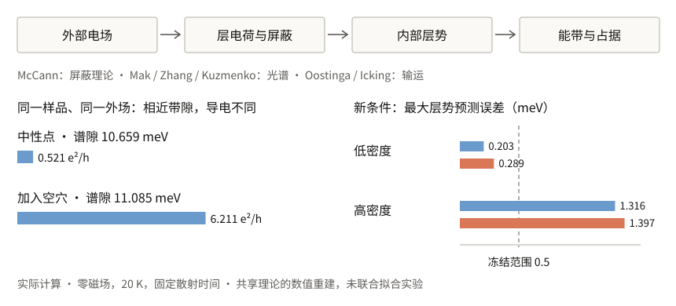

**共同机制与计算结果。** 电场推动层电荷重新分配，内部层势改变能带。相近带隙的两个计算点，导电相差 11.9 倍。中性点拟合的两种屏蔽关系能预测低密度新条件的层势，进一步增加密度后都失效。

[进入屏蔽 prototype：切换样品，检验预测 →](blg-prototype-screening-20261009.html)

McCann 的理论、Mak／Zhang／Kuzmenko 的光谱和 Oostinga／Icking 的输运连接了这条物理主线。具体共享的是屏蔽与层势开隙框架。吸收峰和器件电阻还需各自的观测模型。当前计算完成了共同理论的数值重建与适用范围检验，尚未用同一组参数联合复现这些实验。

### 四种候选态竞争，哪一条边界会改变电子排列？

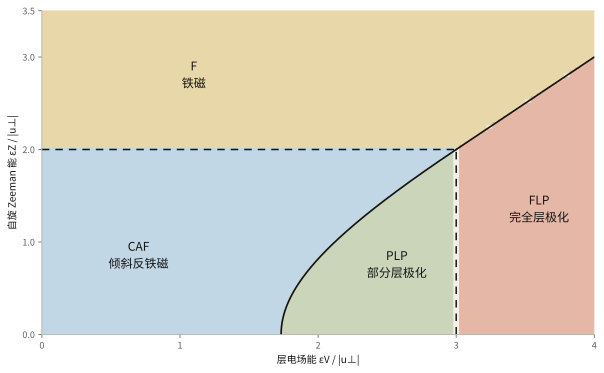

**实际复算的局部理论相图。** 比较 10,201 个点的四种候选能量，重建 Kharitonov 的自旋与层极化竞争。连续端点和一阶能量交叉有不同含义，可以在子页面逐点查看。

[进入竞争态 prototype：点相图，看能量与排列 →](blg-prototype-four-state-20261009.html)

Kharitonov 的理论与 Maher 的倾斜磁场实验共享“层电场与自旋能量竞争”的解释框架。它能提出区分候选态的实验路径。实际电场、磁场与相互作用能标需要校准，四种候选也没有覆盖全部可能态。

## 大量论文可以共享物理主干，条件差异仍须保留

这类器件最重要的两个旋钮是 n（载流子密度，即单位面积放入多少电子或空穴）与 D（外部垂直电场的常用表征，即对两层施加多少不平衡）。上下栅极可分别调节它们。电子重新分布后，内部留下层势差 U；它与外部 D 的关系取决于屏蔽、介电环境和栅距。不同论文也会使用 D/ε₀ 或 E，比较前必须核对各自定义。

在同一套结构与参数下，能带描述电子可以占据哪些能量，波函数描述它们分布在哪一层和亚晶格。由此可以计算吸收光谱、量子电容、回旋轨道和谷响应。相互作用进一步改变自旋、谷、层和动量空间的占据。最后还要经过无序、边界、接触和探针，才得到电阻等仪器读数。

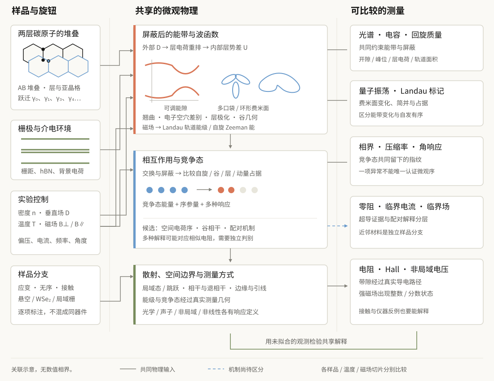

这张图是本综述的机制关联示意，没有数值相界。连线表示共同的物理输入或候选解释，不表示各现象已经由一个模型定量复现。超导机制、空间电荷序和巨大非线性响应还存在开放问题。

一个模型不需要给每篇论文添加一个新项。它需要保留解释多种观测所必需的项，并为样品专属条件设置分支。例如，γ₃（三角翘曲的层间跃迁）改变低能费米面，γ₄ 等跃迁产生电子与空穴不对称；无序势决定局域化路径；WSe₂ 近邻引入自旋轨道作用；局域栅和引线决定真实器件的空间边界。每一项应有独立观测约束。

这里的“统一”有一个可以检验的含义：用固定的共享参数同时解释几种观测，再预测未用于拟合的样品或控制切片。若每条曲线都能自由调整参数，就还没有证明这种预测能力。

## 一张相图需要展开成不同温度、磁场与样品的切片

把所有相名塞进一幅 n–D 图会丢掉决定性条件。本综述把真实论文图组织成可切换的图谱：零场竞争、超导、强磁场和非线性响应。各图保留原坐标和图例。颜色有时代表电阻，有时代表电容或导数，不能直接互换。

|切片|直接看到的特征|额外条件与结论边界|
|---|---|---|
|零场电容与输运|可压缩性异常、导电区域、密度边界|谷和自旋的具体排列还需场响应、振荡与其他观测|
|普通双层的超导|窄零阻带、临界电流、温度和磁场依赖|Zhou 等图 2 的超导在面内场 165 mT 下出现，名义温度 10 mK|
|WSe₂ 近邻超导|更宽的超导窗口、两类超导态|近邻自旋轨道作用及层极化改变了问题本身|
|强磁场量子 Hall|纵向电阻极小、Hall 平台、层/谷/轨道转变|Huang 等图 1 为垂直场 18 T、20 mK；不能并入零场相图|
|角分辨非线性输运|一重/三重角响应、极轴与张量变化|测量几何、应变和微观机制都参与解释|

真实边界应来自原论文数据、声明误差的图像数字化或明确近似的计算。论文切片保留原图，没有新做边界数字化。下文另有引擎响应图与四候选态局部复算，各自说明模型范围；全局机制图是示意。

## 栅极先改变能带，再让相互作用得到新的舞台

McCann 的四能带屏蔽模型把层势差与能隙联系起来 [1]。Oostinga 等的双栅输运展示了垂直场诱导的高电阻态 [2]。Mak 等的红外吸收给出开隙的光谱证据 [3]。Zhang 等用双栅红外测量分开密度与垂直场，构成开隙主线的另一项经典证据 [29]。Kuzmenko 等把吸收峰与能带参数相连 [4,5]。这些工作共同约束“外部场怎样改变内部能带”，各自测量的量并不相同。

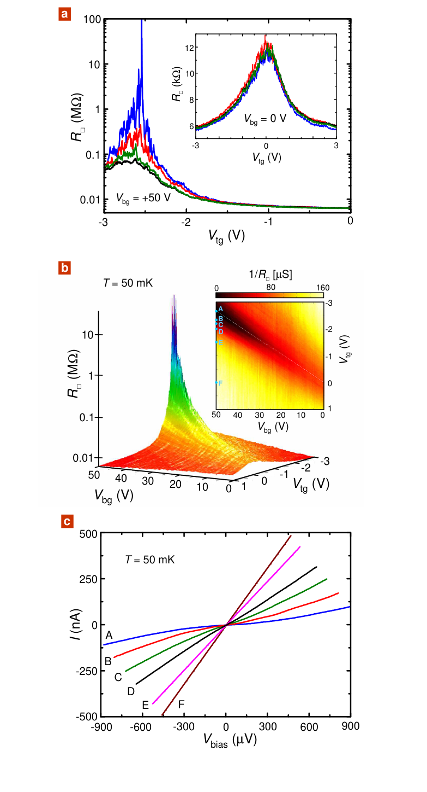

**Oostinga 等，图 4；0707.2487v2，物理 PDF p21。** 随上下栅压与温度变化的电阻，以及 50 mK 下的非线性 I–V。外部场可以大幅压低导电。该图是输运证据，没有直接测量谱隙。来源：[Nature Materials 2008](https://doi.org/10.1038/nmat2082)。

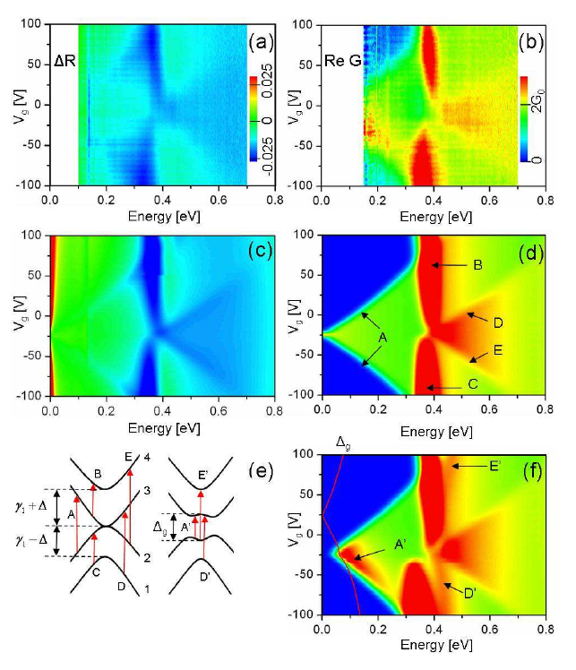

**Kuzmenko 等，图 3；0810.2400v2，p3。** 栅压–光子能量平面中的实测反射/光电导和模型对照，包含跃迁示意。峰的位置、强度和消失条件共同约束能带。作者保留了预测卫星峰不明显等失配，不能将配图理解为所有谱形都已解释。来源：[Physical Review B 2009](https://doi.org/10.1103/PhysRevB.79.115441)。

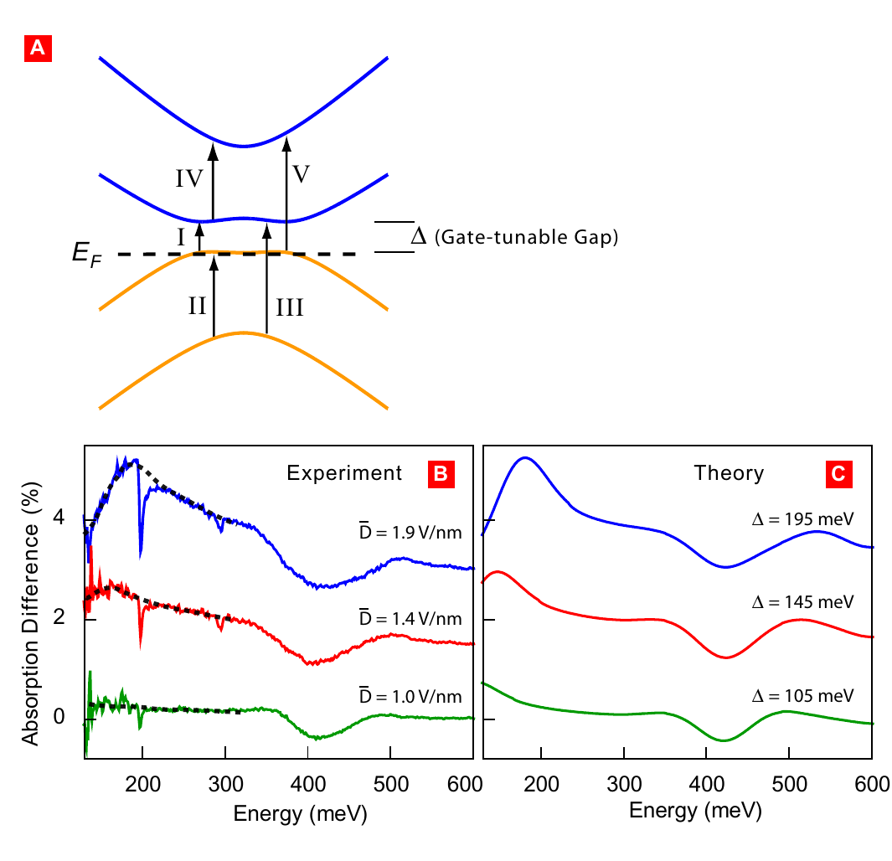

**Zhang 等，OSTI 作者稿图 2，p13，正文 p6–7。** 在中性点附近，低能吸收峰随垂直场移动。约 200 meV 附近的窄非对称峰被解释为 G 声子与电子连续谱的 Fano 干涉，原文说明电子能带模型没有包含它。该作者稿报告最大能隙约 200 meV；期刊公开摘要报告 250 meV，不能把后者移写进此图。来源：[作者稿](https://www.osti.gov/biblio/974550) / [Nature 2009](https://doi.org/10.1038/nature08105)。

需要区分几种常被叫作“隙”的量：谱隙是价带最高点与导带最低点之间的能量差；光学峰还受选择规则、占据、展宽和激子影响；激活能是从某一温区的导电率拟合出来的障碍尺度；器件输运窗口还受局域态和接触影响。在特定热激活导电模型里，谱隙可近似等于两倍激活能，其他机制下不能直接使用这个关系。

同一个能带故事还有更精细的检验。电子与空穴的 SdH 振荡（随磁场周期出现的导电振荡）随温度衰减，可以提取回旋质量。Zou、Hong 与 Zhu 观察到空穴质量约为电子的 1.2–1.3 倍 [6]。这个质量描述电子沿回旋轨道运动的响应，不能直接用热态密度拟合的质量替代。

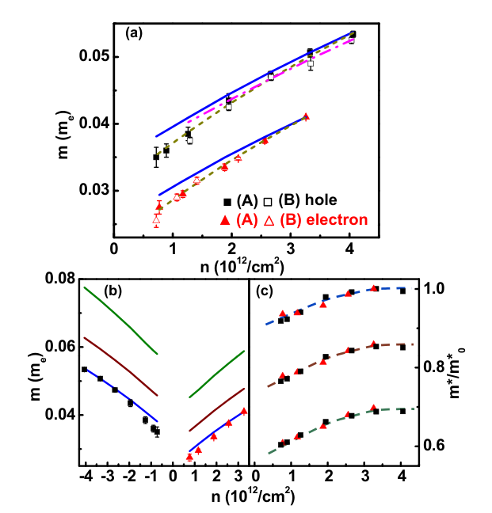

**Zou、Hong 与 Zhu，图 3；1103.1663v2，p4。** 数据和多种能带参数计算随密度的比较。电子/空穴不对称跃迁参数、无序与相互作用重整化需要分别检查。来源：[Physical Review B 2011](https://doi.org/10.1103/PhysRevB.84.085408)。

三角翘曲还会让一个费米面分成多个口袋。费米面是电子填充到当前能量时在动量空间形成的边界；Lifshitz 转变是这些边界连接方式的改变。它可以产生新的振荡频率和态密度特征，同时不要求新的自发有序相。Varlet 等把可调能带与这种变化联系起来 [7]；Seiler 等用弱磁场能级标记进一步检验多锥结构 [8]。

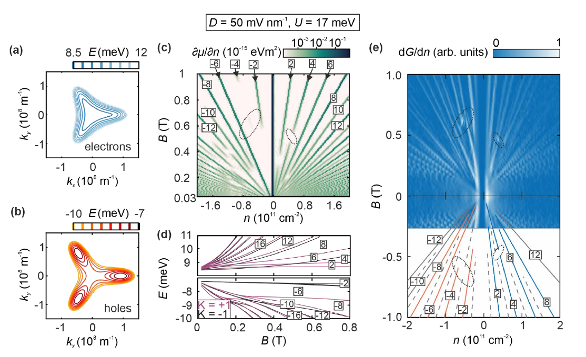

**Seiler 等，图 2；2311.10816v1，p12。** 费米面、计算的 Landau 能级与实验 dG/dn 标记并列。外部 D=50 mV/nm，模型 U=17 meV，计算温度 0.1 K，器件测量底温约 10 mK。图中的部分虚线量子 Hall 态涉及相互作用，整图不能归为裸能带的复现。来源：[Nature Communications 2024](https://doi.org/10.1038/s41467-024-47342-0)。

## 同一条能隙规律，可以对应非常不同的低温电阻

Icking 等汇集了不同器件的输运结果：低温最大电阻相差多个数量级，而高温模型提取的能隙随电场变化较接近 [9]。这是连接大量文章的具体例子。共享的能带与屏蔽决定一部分能标，无序、栅工艺、接触与导电路径决定低温电流能不能通过。

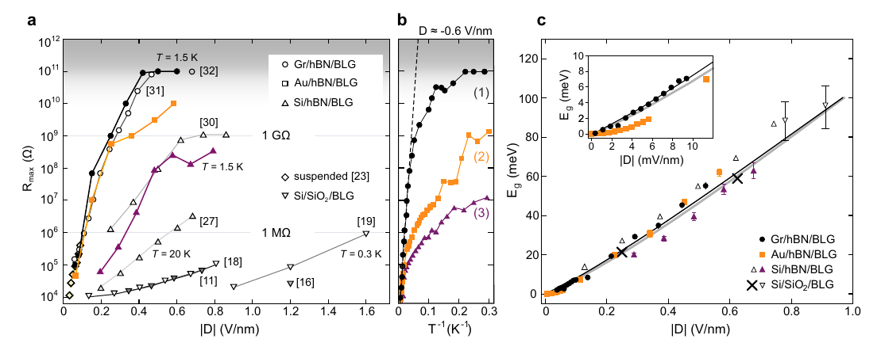

**Icking 等，图 3；2206.02057v2，p4。** 左图汇集 12 个器件/栅工艺，右图比较高温提取的 Eg(D)。跨论文电阻曲线的温度并不完全相同，所以差别不能全部归于工艺；灰区是测量上限；Eg 是特定热激活模型的提取值。来源：[Advanced Electronic Materials 2022](https://doi.org/10.1002/aelm.202200510)。

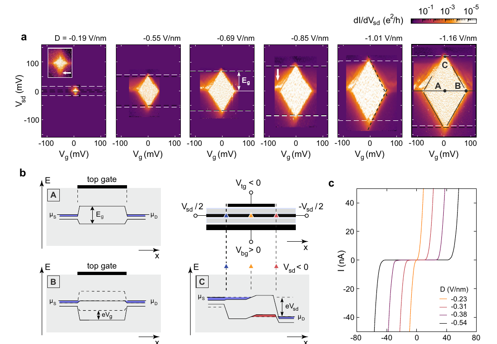

**Icking 等，图 4；p6，T=50 mK。** 随 D 改变，有限偏压电导图中的低导电窗口扩大。图包含接触及 p–n 对齐的解释，不能把 diamond 宽度不加条件地当成纯净材料谱隙。

早期器件在更宽温区里揭示了热激活与局域态跳跃。Taychatanapat–Jarillo-Herrero 在 0.3–100 K 数据中倾向最近邻跳跃；其变程跳跃交叉温度估计不高于约 80 mK，未实际测到 [10]。Zou–Zhu 在 1.5–220 K 数据中加入变程跳跃描述低温弯曲，同时承认该温区有限 [11]。两种解释的差别需要连同样品和温度比较，不能强并成一个普适拟合式。

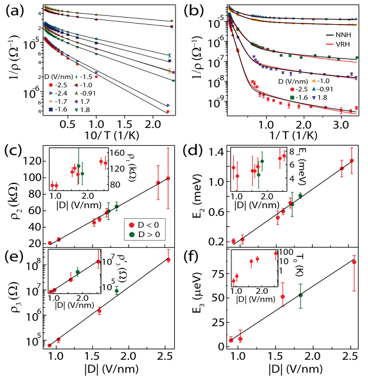

**Taychatanapat–Jarillo-Herrero，图 3；1009.0714v1，p3。** 逆温度图、模型对照及随位移场变化的拟合尺度。部分能标来自模型拟合而非直接能谱测量。来源：[Physical Review Letters 2010](https://doi.org/10.1103/PhysRevLett.105.166601)。

Min 等在无序的自洽 Born 近似下指出，态密度隙与光学隙可有不同的无序响应 [12]。这提供了机制例子，但该近似没有完整求解局域化和跳跃输运。弱局域化文献进一步说明，相干电流取决于谷间散射、三角翘曲和退相干 [13]；不同器件出现或不出现低温相干时间饱和，不能直接判为互相矛盾。

## 电子之间的竞争，产生相似信号背后的不同候选态

普通双层有自旋和两个谷（动量空间中两组低能区域），也有层与亚晶格结构。常用的 flavor 或 isospin 是对这些内部类别的统称。交换作用可以让电子更偏向某些类别，也可以建立不同类别之间的相干叠加。具体排列需要多种观测区分。

悬空器件是重要早期分支。Freitag 等在中性点观测到零磁场下的低偏压导电抑制，并区分两个温度和密度响应不同的能标 [14]。作者讨论自发能隙、残余导电与边缘态。此证据不唯一确定量子反常 Hall 或层反铁磁身份。悬空与 hBN 封装的屏蔽环境不同，不能把两者的中性点结果直接视为同一实验条件。

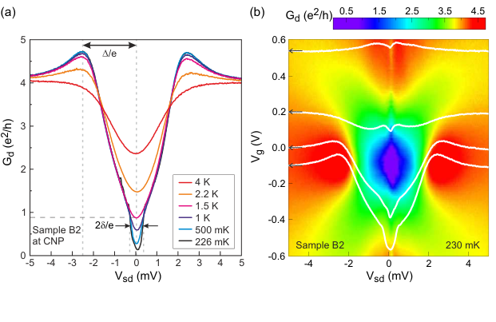

**Freitag 等，图 4；1104.3816v2，p3。** 不同温度下的微分电导及偏压–栅压图。较大能标约 2.5 meV，较小能标约 0.35 meV；两者的密度和温度行为不同。作者对较小能标讨论整片充电解释。具体微观序仍是解释层。来源：[Physical Review Letters 2012](https://doi.org/10.1103/PhysRevLett.108.076602)。

在更洁净的双栅器件里，de la Barrera 等用穿透场电容发现随 n、D 改变的级联，并用量子振荡检查占据简并度 [15]。Zhou 等用输运与振荡发现不同金属区域 [16]。两类探针连接了同一问题：电子如何在自旋、谷和费米面口袋之间重新分配。

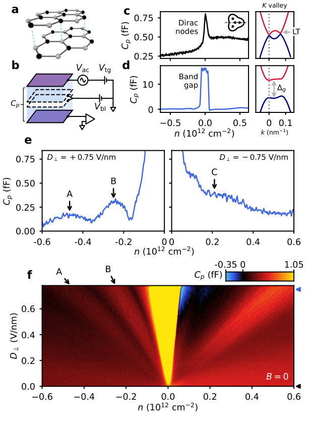

**de la Barrera 等，图 1；2110.13907v1，p2。** 零磁场穿透电容、能带示意和密度–位移场图。电容异常是实测，右侧能带是解释模型。来源：[Nature Physics 2022](https://doi.org/10.1038/s41567-022-01616-w)。

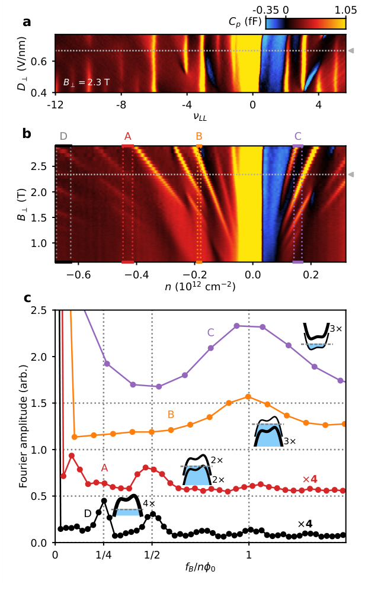

**同文图 3，p3。** 上图 B⊥=2.3 T；下方磁场–密度切片固定 D=0.67 V/nm。按总密度归一化的频率峰约束费米面面积如何分配。频率与简并变化支持竞争态，不能单凭它们确定所有谷相干方向。

Seiler 等在空穴侧观测到多段导电区域、滞回和磁场依赖 [17]，在电子侧进一步发现准绝缘区域与超低偏压非线性 [18]。电子侧 Methods 明确使用此前空穴工作中的 device A：这是同一器件支撑多种物理研究的直接实例。它们对纯单粒子解释构成新约束。但非费米液体、Wigner 晶体、电荷/自旋密度波等候选，并没有被这些共同特征唯一分开。电子侧论文也明确保留真正零场基态的未知。

另一项引人关注的悬空器件工作是 Geisenhof 等提出的量子反常 Hall 八重态 [30]。低场 ν=±2 轨迹延伸到小于 20 mT，并出现磁滞。作者以轨道磁性解释这些结果；该实验的双端电导同时混入纵向与 Hall 分量，不能描述成严格零场下独立 Hall 电阻的精确量子化。它提供了值得与封装器件比较的独立样品分支。

## 超导已经有多项观测支持，配对机制仍需要判别

普通 Bernal 双层里的超导非常窄，也非常低温。Zhou 等图 2 在名义温度 10 mK、面内磁场 165 mT 下出现零阻带，并展示临界电流、垂直磁场破坏与 BKT 转变分析（二维超导中由涡旋行为控制的转变），提取 TBKT≈26 mK [16]。这里“测到超导”“支持自旋三重态解释”和“确定配对胶水”是三层结论。作者未排除声子机制。

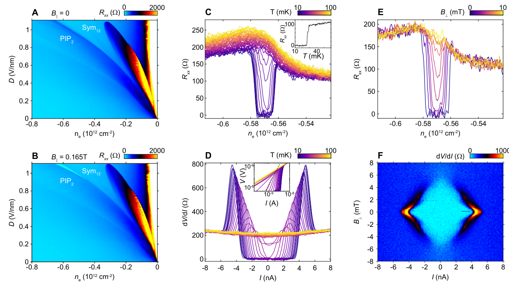

**Zhou 等，图 2；2110.11317v2，p3。** 面内场为 0 与 165 mT 的 n–D 图、R(T)、I–V 及垂直场响应。零阻带与旁边金属区域相邻，但邻近本身不能证明这些区域的涨落提供配对作用。来源：[Science 2022](https://doi.org/10.1126/science.abm8386)。

加入 WSe₂ 后，层选择性的近邻自旋轨道作用改变了能带与自旋响应。Zhang 等在该独立器件分支观测到最高 Tc 约 300 mK、BKT 温度约 260 mK、密度窗口约 2×10¹¹ cm⁻² [19]。这些数值属于论文所测器件，不能作为普通双层在相同场下的保证。

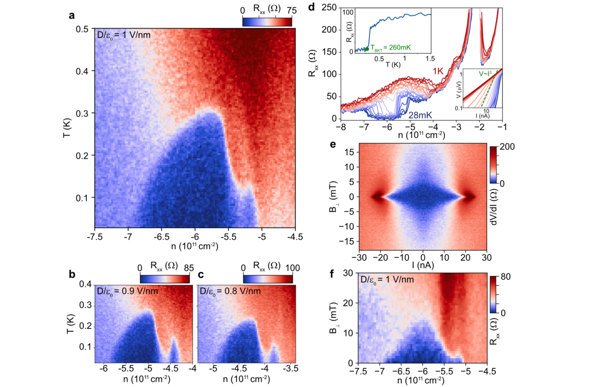

**Zhang 等，图 2；2205.05087v1，p12，主文 p3。** 超导 dome、R(T)、I–V 与垂直磁场依赖。最大垂直临界场约 15 mT。来源：[Nature 2023](https://doi.org/10.1038/s41586-022-05446-x)。

Holleis 等随后区分 SC1、SC2；量子振荡支持 SC2 的正常态破坏旋转对称性，并检验面内磁场的轨道退配对 [20]。尤其有价值的是同条件测量输运与压缩率（电子数变化时化学势怎样变化）：SC2 大部分超导区域位于向列正常态内部，而非紧贴一阶 isospin 相界。这约束“所有超导都由相界附近涨落驱动”的强解释。它没有排除全部电子配对机制。

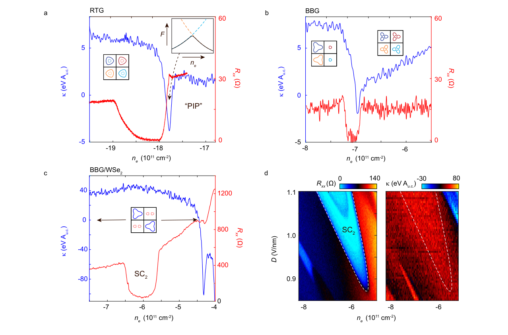

**Holleis 等，图 4；2303.00742v2，p6。** a 为菱方三层 RTG，b 为普通 Bernal 双层，c–d 为 Bernal 双层/WSe₂。不同材料标签必须保留。c–d 中白虚线把超导范围叠到逆压缩率图上。来源：[Nature Physics 2024](https://doi.org/10.1038/s41567-024-02776-7)。

Li 等在另一类双层/WSe₂ 器件中同时测到电子与空穴侧的超导 [31]。其提取的最高 BKT 温度约为 210 mK 与 400 mK；两侧都有明显近邻自旋轨道作用，但空穴侧违反常规自旋顺磁极限，电子侧遵守。这说明“加了自旋轨道作用就能解释全部超导”仍是过强说法。声子吸引与屏蔽排斥作用的理论路线也都需要列入比较，不能仅凭临界温度接近就选定配对机制。

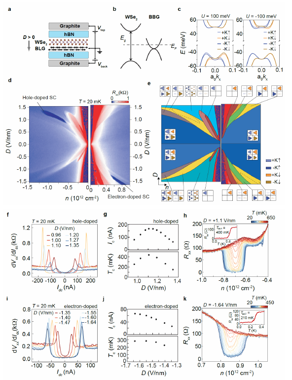

**Li 等，图 1；2405.04479v1，p17，图注 p18。** 20 mK 的 n–D 电阻图、作者分区与两侧超导指纹。分区有实验依据，口袋示意含自旋/谷类别不混合的假设。不同器件的 Tc 与 BKT 温度不可混排成同一种定义。来源：[Nature 2024](https://doi.org/10.1038/s41586-024-07584-w)。

## 强磁场把竞争投影到 Landau 能级与分数填充

垂直磁场让电子的轨道能量离散成 Landau 能级。双层低能能级带有自旋、谷和轨道类别；位移场、交换作用与面内场改变这些类别的竞争。固定填充 ν（相对于磁通量的电子占据数）后，D–B 图能约束层极化和自旋响应。倾斜场还能帮助区分主要受自旋 Zeeman 能影响的行为与垂直轨道效应。

最低能级的平均场理论提出自旋、谷、层及相干态的竞争 [21,22]。这些相名应连回计算的序参量和实验判据。特别是零场连续能带模型、有限场投影模型和强场的有限多体计算，各有适用范围，不能自动互换。

这里还实际复算了 Kharitonov 的四候选态理论 [32]。固定 ν=0、T=0，采用最低 Landau 能级投影与均匀平均场，取两个各向异性作用参数 u⊥=−1、uz=2。在 10,201 个控制点比较四种候选能量，得到铁磁 F、倾斜反铁磁 CAF、部分层极化 PLP 与完全层极化 FLP。横轴是层电场能 εV，纵轴是自旋 Zeeman 能 εZ，两者用 |u⊥| 归一化。这个计算有原始能量数组，属于可复算的局部理论相图。

**本综述复算，Kharitonov 1105.5386v2，p3。** [打开交互竞争态 prototype](blg-prototype-four-state-20261009.html)。 只比较四个声明候选，未包含所有纹理、轨道相干或无序畴。CAF 与 PLP 能量公式各有有效端点；超出端点后不继续外推。轴是无量纲能量，不是直接的 V/nm 与 T。实线为候选一阶交叉，虚线为连续端点。来源：[Physical Review Letters 2012](https://doi.org/10.1103/PhysRevLett.109.046803)。

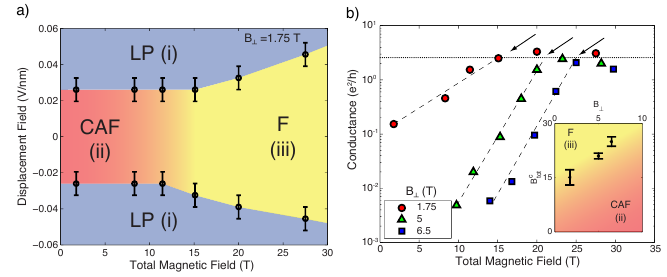

**Maher 等，图 4；1212.3846v2，p4。** 固定 ν=0、B⊥=1.75 T，扫描位移场与总磁场 Btot。实验区分层极化、低场绝缘和高场导电区域；CAF/F 是结合理论作出的解释，PLP 与 FLP 没有被唯一分开。原图颜色渐变表示作者对连续变化的示意。未经相互作用与屏蔽校准，不能把这张图与上方理论图按同一数值轴叠加。来源：[Nature Physics 2013](https://doi.org/10.1038/nphys2528)。

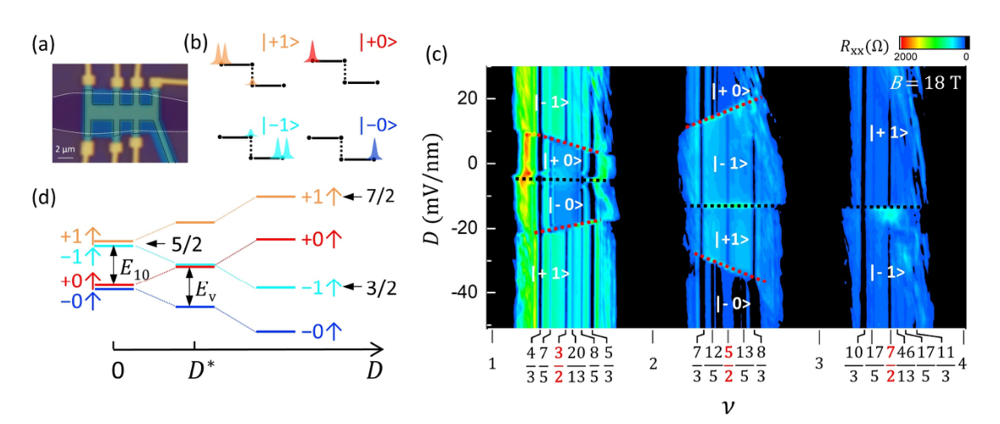

**Huang 等，图 1；2105.07058v5，p8，B⊥=18 T，T=20 mK。** Rxx(D,ν) 图与层/谷/轨道模型示意。低纵向电阻及量子化 Hall 电阻支持分数量子 Hall 态。来源：[Physical Review X 2022](https://doi.org/10.1103/PhysRevX.12.031019)。这里固定使用 v5，另已核读两页[正式勘误](https://doi.org/10.1103/PhysRevX.12.049901)：负填充的电子/空穴坐标约定改变 Pfaffian/anti-Pfaffian 标记，作者说明它不改变粒子空穴对称性破缺的结论。坐标定义需先统一，不能把这项更正说成分数态观测被推翻。

偶分母分数量子 Hall 态尤其引人关注，因为部分候选态可具有非 Abelian 统计：交换准粒子会改变多个简并态之间的量子状态。这种统计需要额外测量。电阻平台、激活隙与 Moore–Read 候选波函数相容，还不足以声称已经观察到非 Abelian 交换。

零场 Wigner 晶体的理论提供对密度、翘曲和口袋结构的预测 [23]。有限场的分数态计算需要另行比较，如 Landau 能级混合下的候选配对态与复合费米液体 [33]。有限尺寸、近似相互作用和有限候选态集合会限制结论。这里将它们列为理论预测，未并入实测相区。

## 非局域与非线性信号，可以为同一个模型增加新约束

位移场破坏层反演对称性后，两个谷可具有相反的 Berry 曲率（一种影响波包运动的波函数几何量）。这允许电荷 Hall 响应相消而谷响应不相消。Shimazaki 等观测到显著非局域电阻 RNL（在远离注入电流的位置测到的电压与电流之比），并讨论谷流扩散 [24]。但真实远端电压还取决于边界、普通电流扩散与测量输入阻抗。

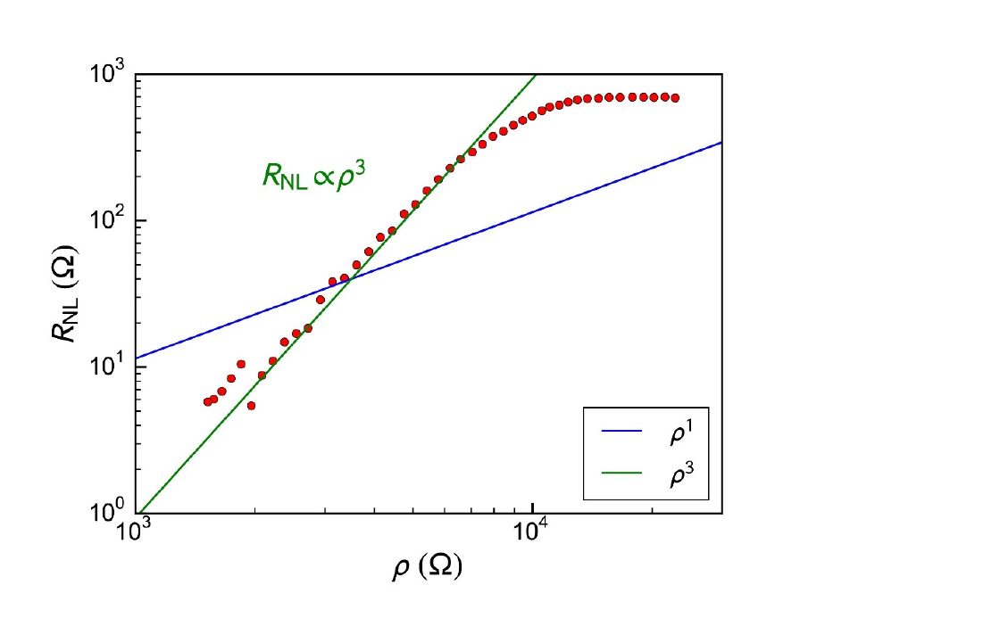

**Shimazaki 等，图 4；1501.04776v1，p17，主文讨论 70 K 数据。** 小谷 Hall 角近似下，RNL 可随局域电阻率近似呈 cubic 标度；大角度时简单公式失效。原文补充还展示有限输入阻抗造成 square 标度的反例。两者都有各自器件条件，不能据此泛称所有非局域信号都是伪象。来源：[Nature Physics 2015](https://doi.org/10.1038/nphys3551)。

角分辨非线性输运为口袋占据和旋转对称性提供另一种探针。Lin 等观测到可调极轴及一重/三重角响应 [25]。图中口袋占据小圆点是可能的解释示意，不能当作直接的动量成像。显式应变、接线和自发向列序需要不同判据。

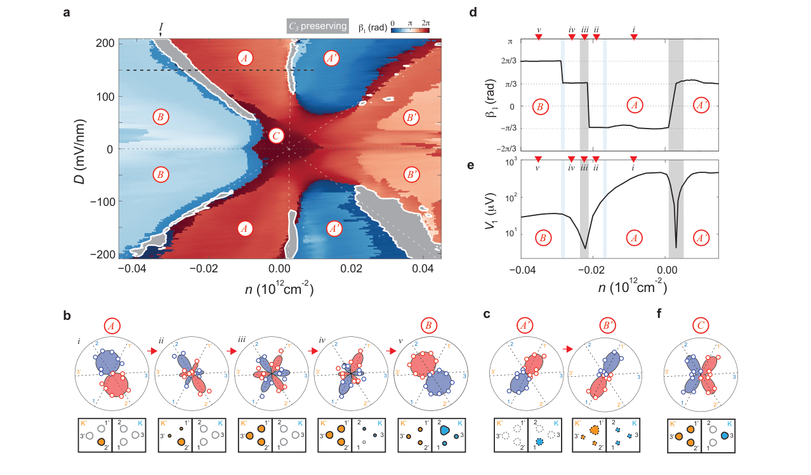

**Lin 等，图 2；2302.04261v2，p3。** n–D 极轴图和极坐标响应为实测/提取量，下方口袋占据是候选示意。来源：[固定 arXiv 版本](https://arxiv.org/abs/2302.04261v2)。

Chichinadze 等对多接线配置提取非线性电导张量，在同一器件中发现相区内较稳定的极轴和极大的幅度 [26]。作者指出，已知微观机制无法解释该幅度，相差多个数量级。这是适合自主理论系统的真实目标：一个候选解释要同时满足角张量、n–D 依赖、幅度预算和接线复核。只拟合极轴还不足够。

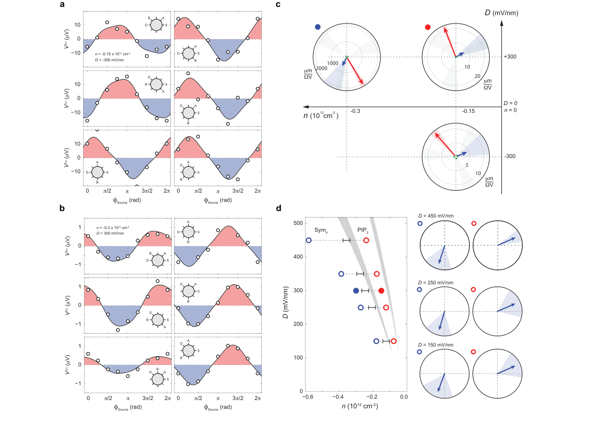

**Chichinadze 等，图 4；2411.11156v2，p7，T=20 mK。** 六种测量配置、各配置多次接线、拟合向量及 n–D 极轴变化。论文对靠近弹道区的幅度不确定性另有说明。来源：[固定 arXiv 版本](https://arxiv.org/abs/2411.11156v2)。

器件几何还构成另一组可统一工作。量子点、量子点接触 QPC（由局域栅形成的狭窄电子通道）、p–n 结和干涉仪都可从同一能带与空间势出发，但必须显式加入边界和引线。QPC 电导台阶、Fabry–Pérot 干涉条纹、Aharonov–Bohm 振荡与量子点长寿命属于有趣器件现象，不应自动增加为均匀材料的 bulk 相。光学、声子和等离激元分支也需要各自的驱动与响应计算。完整条目可在文献浏览器按现象检索。

## 值得追问的，是具体解释在哪一步超出了证据

以下标记指向可核查的主张，保留作者自己的限定。它们不对整篇文章作真假判断。相似信号可来自不同机制，优先对齐器件、控制量、温区、场方向和电路，再判断是否冲突。

|来源|确实有的证据|需要继续查证的解释|能帮助区分的观测|
|---|---|---|---|
|Seiler 等 2022 [17]，p9–10|导电区域 I–IV、滞回、温度与磁场特征|非费米液体是 likely；Wigner-Hall 是 consistent；都未唯一确定|同条件热力学、噪声、频率与空间序探针|
|Seiler 等 2024 [18]，p3、6|电子侧准绝缘温度行为、低偏压非线性、场响应|零场基态未知；电荷密度波、自旋密度波、Wigner 晶体仍待区分|场方向、非线性频率、压缩率及空间/噪声证据|
|Lin 等 [25]，p3|角响应及极轴变化|口袋占据是候选示意；自发性须与显式应变区分|应变控制、晶轴/电极旋转、独立振荡|
|Chichinadze 等 [26]，p8|巨大非线性张量及接线复核|现有机制解释不了量级；不能把形状符合视为完整解释|统一幅度预算、弹道与耗散分解、尺寸与接触依赖|
|Gorbar 等 [21]，p13–14|有限场模型的相序与部分趋势|最大理论临界斜率约 4.7，实验对照约 11 mV/nm/T；另一比较重标 4.4 倍属于校准|固定参数后的其他填充与样品预测|
|Huang 等 [27]，p4|ν=5/2 的纵向极小、Hall 量子化与激活行为|分数态观测不等于非 Abelian 统计已被测到|中性模式、热输运或更直接的准粒子统计证据|
|Zhou 等 [16]，p3–4|零阻、临界电流、BKT、磁场依赖|三重态与配对作用需要分层讨论，声子机制未被排除|自旋/轨道响应、声子控制、同条件热力学|
|Taychatanapat 与 Zou–Zhu [10,11]|各自有限温区的导电曲线|最近邻/变程跳跃不是由短温区拟合唯一确定|扩展温区，检查加热、接触及并行导电路径|

正文所列数值失配来自固定版本原文。图谱不会把“机制未知”涂成一种新相，也不会把理论提案画成实测区域。

## 没有冰箱时，先做能被新数据推翻的统一解释

这篇综述为模拟引擎提供三项具体问题。第一，用同一套屏蔽能带连接光谱、电容、回旋质量和高温激活，另行描述低温漏电。第二，比较自旋/谷/层/动量竞争能否同时解释密度边界、量子振荡、压缩率与角响应。第三，对超导与巨大非线性响应同时约束曲线形状和量级，主动寻找无法兼容的观测。

这些问题可以先用公开数据和理论研究。理论不会自动变成材料事实：候选机制需要冻结参数，并在未参与拟合的图、样品或控制切片上预测。等有新实验时，再按模型分歧选择测量，让一项结果能够淘汰一批解释。

文献的空白也不自动证明新颖性。若系统提出新机制，还需要检查未纳入的论文、独立计算和反例，再由领域专家判断它是否构成新物理。

## 文献条目保留观测、解释、预测与结构边界

原库下载 191 个论文来源，保留 187 篇，提取 241 条主要主张，按 13 个现象族组织；其中 83 篇归为普通 AB。历史补缺另有 5 篇主论文、14 条主张，以及 1 份同篇补充。本轮补缺去重后为 6 篇：Zhang 2009 作者稿、Zhang 与 Holleis 两篇近邻超导、Li 的电子/空穴超导、Maher 倾斜场和 Geisenhof 悬空 QAH；Zhang 2009 新增 4 条版本明确的主张。共 202 个来源（含原库 4 个排除）、259 条结构化主张。族间有重叠，不能将每族篇数相加作为独立文章数，也不能把 13 个现象族称为 13 个相。

这些来源经过定向审读，并非每篇全文及所有补充材料均完成精读。正文锚点进一步核对原 PDF 与图。原库混有理论、特殊器件和结构不明来源，保留它们供比较，不能把总篇数称为普通 AB 实验篇数。页面的文献浏览器显示实际结构、主张类型与页码；排除来源也留有记录。

### 正文参考文献

1. McCann, *Asymmetry gap in the electronic band structure of bilayer graphene*, PRB 2006. [DOI](https://doi.org/10.1103/PhysRevB.74.161403)；cond-mat/0608221v2。
2. Oostinga et al., *Gate-induced insulating state in bilayer graphene devices*, Nature Materials 2008. [DOI](https://doi.org/10.1038/nmat2082)；0707.2487v2。
3. Mak et al., *Observation of an Electric-Field Induced Band Gap in Bilayer Graphene by Infrared Spectroscopy*, PRL 2009. [DOI](https://doi.org/10.1103/PhysRevLett.102.256405)；0905.0923v2。
4. Kuzmenko et al., *Infrared spectroscopy of electronic bands in bilayer graphene*, PRB 2009. [DOI](https://doi.org/10.1103/PhysRevB.79.115441)；0810.2400v2。
5. Kuzmenko et al., *Determination of the gate-tunable bandgap and tight-binding parameters in bilayer graphene using infrared spectroscopy*, PRB 2009. [DOI](https://doi.org/10.1103/PhysRevB.80.165406)；0908.0672v1。
6. Zou, Hong & Zhu, 回旋质量与电子空穴不对称，PRB 2011. [DOI](https://doi.org/10.1103/PhysRevB.84.085408)；1103.1663v2；arXiv 与期刊题名不同，作者与 DOI 对应。
7. Varlet et al., *Tunable Fermi surface topology and Lifshitz transition in bilayer graphene*. [原文](https://arxiv.org/abs/1508.02922v1)。
8. Seiler et al., *Probing the tunable multi-cone bandstructure in Bernal bilayer graphene*, Nature Communications 2024. [DOI](https://doi.org/10.1038/s41467-024-47342-0)；2311.10816v1。
9. Icking et al., *Transport spectroscopy of ultraclean tunable band gaps in bilayer graphene*, Advanced Electronic Materials 2022. [DOI](https://doi.org/10.1002/aelm.202200510)；2206.02057v2。
10. Taychatanapat & Jarillo-Herrero, *Electronic transport in dual-gated bilayer graphene at large displacement fields*, PRL 2010. [DOI](https://doi.org/10.1103/PhysRevLett.105.166601)；1009.0714v1。
11. Zou & Zhu, *Transport in gapped bilayer graphene: The role of potential fluctuations*, PRB 2010. [DOI](https://doi.org/10.1103/PhysRevB.82.081407)；1008.0783v1；1008.0984v1 为同篇补充。
12. Min et al., *Optical and transport gaps in gated bilayer graphene*, PRB 2011. [DOI](https://doi.org/10.1103/PhysRevB.84.041406)；1104.0938v2。
13. Kechedzhi et al., *Influence of trigonal warping on interference effects in bilayer graphene*, PRL 2007. [DOI](https://doi.org/10.1103/PhysRevLett.98.176806)；cond-mat/0701690v2。
14. Freitag et al., *Spontaneously gapped ground state in suspended bilayer graphene*, PRL 2012. [DOI](https://doi.org/10.1103/PhysRevLett.108.076602)；1104.3816v2。
15. de la Barrera et al., *Cascade of isospin phase transitions in Bernal bilayer graphene at zero magnetic field*, Nature Physics 2022. [DOI](https://doi.org/10.1038/s41567-022-01616-w)；2110.13907v1。
16. Zhou et al., *Isospin magnetism and spin-polarized superconductivity in Bernal bilayer graphene*, Science 2022. [DOI](https://doi.org/10.1126/science.abm8386)；2110.11317v2；元数据旧题名含 spin-triplet，固定 PDF 首页为 spin-polarized。
17. Seiler et al., *Quantum cascade of new correlated phases in trigonally warped bilayer graphene*, Nature 2022. [DOI](https://doi.org/10.1038/s41586-022-04937-1)；2111.06413v1。
18. Seiler et al., *Interaction-driven (quasi-) insulating ground states of gapped electron-doped bilayer graphene*, PRL 2024. [DOI](https://doi.org/10.1103/PhysRevLett.133.066301)；2308.00827v1。
19. Zhang et al., *Spin-Orbit Enhanced Superconductivity in Bernal Bilayer Graphene*, Nature 2023. [DOI](https://doi.org/10.1038/s41586-022-05446-x)；2205.05087v1。
20. Holleis et al., *Nematicity and Orbital Depairing in Superconducting Bernal Bilayer Graphene with Strong Spin Orbit Coupling*, Nature Physics 2024. [DOI](https://doi.org/10.1038/s41567-024-02776-7)；2303.00742v2。
21. Gorbar et al., *Broken-symmetry states and phase diagram of the lowest Landau level in bilayer graphene*, PRB 2011. [DOI](https://doi.org/10.1103/PhysRevB.84.235449)；1108.0650v3。
22. Murthy, Shimshoni & Fertig, *Spin-Valley Coherent Phases of the ν=0 Quantum Hall State in Bilayer Graphene*, PRB 2017. [DOI](https://doi.org/10.1103/PhysRevB.96.245125)；1709.02447v2。
23. *Wigner crystallization in Bernal bilayer graphene*. [固定原文](https://arxiv.org/abs/2310.07751v2)。
24. Shimazaki et al., *Generation and detection of pure valley current by electrically induced Berry curvature in bilayer graphene*, Nature Physics 2015. [DOI](https://doi.org/10.1038/nphys3551)；1501.04776v1。
25. Lin et al., *Spontaneous momentum polarization and diodicity in Bernal bilayer graphene*. [固定原文](https://arxiv.org/abs/2302.04261v2)。
26. Chichinadze et al., *Observation of giant nonlinear Hall conductivity in Bernal bilayer graphene*. [固定原文](https://arxiv.org/abs/2411.11156v2)。
27. Huang et al., *Valley Isospin Controlled Fractional Quantum Hall States in Bilayer Graphene*, PRX 2022. [DOI](https://doi.org/10.1103/PhysRevX.12.031019)；2105.07058v5。
28. McCann & Koshino, *The electronic properties of bilayer graphene*, Reports on Progress in Physics 2013. [DOI](https://doi.org/10.1088/0034-4885/76/5/056503)；1205.6953v2。
29. Zhang et al., *Direct observation of a widely tunable bandgap in bilayer graphene*, Nature 2009. [DOI](https://doi.org/10.1038/nature08105)；本轮读取 [OSTI 974550 作者稿](https://www.osti.gov/biblio/974550)，作者稿题名为 *Optical Determination of Gate-Tunable Bandgap in Bilayer Graphene*；未读付费期刊最终全文。
30. Geisenhof et al., *Tunable quantum anomalous Hall octet driven by orbital magnetism in bilayer graphene*, Nature 2021. [DOI](https://doi.org/10.1038/s41586-021-03849-w)；2107.06915v1。
31. Li et al., *Tunable superconductivity in electron- and hole-doped Bernal bilayer graphene*, Nature 2024. [DOI](https://doi.org/10.1038/s41586-024-07584-w)；2405.04479v1。
32. Kharitonov, *Canted antiferromagnetic phase of the ν=0 quantum Hall state in bilayer graphene*, PRL 2012. [DOI](https://doi.org/10.1103/PhysRevLett.109.046803)；1105.5386v2。
33. Zhu, Sheng & Sodemann, *Widely Tunable Quantum Phase Transition from Moore-Read to Composite Fermi Liquid in Bilayer Graphene*, PRL 2020. [DOI](https://doi.org/10.1103/PhysRevLett.124.097604)；[固定原文](https://arxiv.org/abs/1909.05883v2)。

论文图为注明出处的原文局部渲染裁切，保留坐标、单位和图例；引擎响应与预测图来自保存的微观数组；四态局部相图为本综述实际复算，提供候选能量数组；机制关联图为示意。原始 PDF 页、固定版本、裁图范围与来源信息随交互图谱登记。论文实验的作者原始数组未取得。
