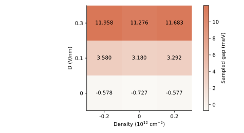
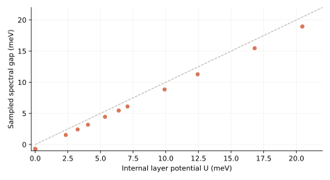
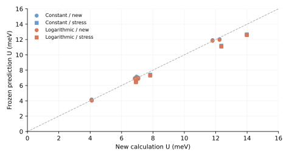

# 同一个开隙机制，为什么导电结果相差很大？

两种简化屏蔽关系能预测同一理论模型中新样品的低密度层势，但在更高密度时失效。

材料是一片 AB/Bernal 双层石墨烯，即两层按特定位置堆叠的碳原子。计算固定零磁场、20 K，以四轨道能带和均匀 Hartree（电荷产生的平均静电场）求解屏蔽。

## 换一个虚拟样品，检验相同外场产生什么响应

[返回综述](blg-literature-review-20261009.html#prototype-section) · [打开竞争态 prototype](blg-prototype-four-state-20261009.html)

现有引擎以同一套四轨道能带参数，计算了 20 组介电环境与栅距、180 个密度—电场条件。载流子密度 n 表示单位面积增加的电子或空穴。位移场 D 是外部栅极的垂直电场控制。切换样品和观测，再点击一格查看它的共同结果。每格是实际计算点，没有补点插值。

为什么不同样品能连接到同一条能带关系？

不同样品使用同一组能带跃迁参数，介电环境与栅距只通过这里的静电模型进入。固定内部层势后，能带关系相同是这个模型的结构性结果。它演示如何连接不同样品，尚未证明真实样品差异都能由内部层势吸收。

## 相近带隙的两个点，导电相差 11.9 倍

同一新样品、同一外场，只改变电子占据。在中性点，采样谱隙为 10.659 meV。加入空穴后，谱隙为 11.085 meV，电导却从 0.521 升到 6.211 e²/h（量子电导单位）。电子可以占据导带或价带，带隙大小因此不足以判定是否导电。

<!--screening-occupancy-->

这里固定介电常数 5、上下栅距 25 与 45 nm、D=0.25 V/nm、20 K。空穴密度为 −0.1×10¹² cm⁻²。电导使用固定散射时间 0.2 ps，只代表均匀材料响应，没有计算局域化与接触电阻。

## 冻结的共享解释可以迁移，也能被新条件推翻

用 40 个中性点拟合并冻结两种关系，描述层电荷之差怎样随内部层势变化。一种取固定比例，另一种允许比例缓慢变化。结合新样品已知的栅极静电，再预测两个新样品的 8 个条件。最大层势误差为 0.203 与 0.289 meV，都在事先冻结的 0.5 meV 内。这批点无法区分两种候选。

随后增加 4 个更高密度条件，系数和误差范围保持冻结。两种关系的最大误差升到 1.316 与 1.397 meV，都超出原范围。12 个新点的粗细网格响应对照全部通过，失配大于这项网格对照发现的层势差异。这个反例要求继续检验密度或化学势对层占据的影响。

这轮选题与拟合由主进程安排，微观引擎完成数值计算。首轮是冻结后的新条件预测，压力测试则是在首轮之后选择的反驳条件。它支持同模型内的迁移与反驳，尚未做实验联合拟合，也没有证明 agent 自主发现未知物理。

## 多篇论文共享屏蔽开隙，观测环节各有条件

外部电场推动两层电荷重新分配，电子产生的电场抵消部分外部作用，这叫屏蔽。内部层势差 U（两层电子能量之差）进入能带，影响谱隙（导带最低能量与价带最高能量的间隔）。光学与输运都受这些能带约束，还要分别计算光的跃迁和电流的路径。

哪些论文共享了哪段理论？

|论文|连接的共同理论|原论文看见什么，以及还需哪些条件|
|---|---|---|
|[McCann 2006](https://arxiv.org/abs/cond-mat/0608221v2)|层电荷参与自洽屏蔽，内部层势进入四能带|单栅连续模型。我们的双栅全布里渊区计算沿用此物理框架，未逐图复现其单栅数值。|
|[Oostinga 2008](https://doi.org/10.1038/nmat2082)|层不对称开隙可压低导电|双栅高电阻与非线性电流。它约束输运，未直接测量谱隙。|
|[Mak 2009](https://arxiv.org/abs/0905.0923)／[Zhang 2009](https://doi.org/10.1038/nature08105)|电场通过内部层势改变能带|红外吸收。Mak 使用电解质栅、密度约 10¹³ cm⁻²。Zhang 使用双栅，约 200 meV 的声子干涉峰需要额外物理。|
|[Kuzmenko 2009](https://doi.org/10.1103/PhysRevB.79.115441)|同一能带约束允许的光学跃迁|峰的位置和强度还取决于占据、选择规则与展宽。当前引擎没有计算完整光谱。|
|[Icking 2022](https://arxiv.org/abs/2206.02057v2)|屏蔽开隙提供一部分输运能标|低温电阻还取决于局域态、工艺和接触。跨器件曲线温度不同，不能把差异全归于工艺。|

近似、数值检查与计算成本

零磁场，全布里渊区四轨道 SWMcC（保留主要层内和层间跃迁）能带，均匀 Hartree。该分支没有交换作用，没有比较关联序。压缩率在固定内部层势下计算，不等于完整自洽栅电容。采样谱隙可以为负，表示采样能带重叠。它不等于光学峰、激活能或器件偏压窗口。

8 个首轮条件与 4 个压力测试均保留粗细网格和原始数组，独立核查共 1,612 项。两个新计算批次使用远程 4 个 CPU worker，合计约 178 秒，没有占 GPU。这里列出的数值核对没有认证实验一致性。

