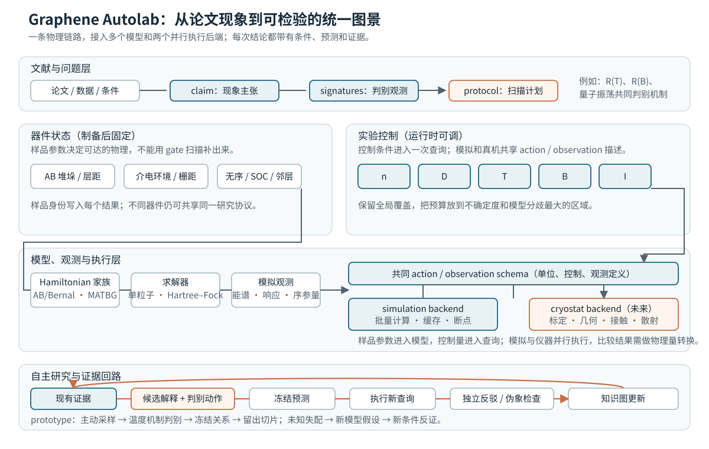

# 让许多现象，连成可检验的图景

Graphene Autolab 的目标是把论文变成可计算的理论图谱，让 agent 自主选择模拟和实验，用新条件检验统一解释。

首期研究对象是一片普通 AB/Bernal 堆垛双层石墨烯。起步纯模拟，凝聚态专家与 agent 专家共同推进。[交互报告](https://guoshaoyang-pku.github.io/blogs/graphene-autolab-prototype-20261007.html)包含论文主张浏览器、可点击架构图、采样回放、温度机制判别、留出预测与微观样品响应。

## 同一套测量，应该能回答许多论文里的问题

你们的出发点是：一个器件经过充分扫描，就能呈现许多值得研究的现象。系统先整理理论，把论文中的主张转成“哪些条件下，哪些观测能区分哪些机制”，再决定下一次计算或测量。

文献集已纳入 187 篇论文，整理出 241 条带条件的结论、13 个现象族。它提供研究入口，尚不是 187 篇论文的逐图复现。定向选择的文献集存在选择偏差。

统一解释使用同一组样品参数约束多个观测，并预测新温度、新磁场或新样品。遇到解释不了的信号，agent 提出最小模型扩展，写出能被推翻的预测。

## 研究环境把论文、模型和下一次实验连接起来

样品的堆垛、层距、介电环境、应变与无序进入物理模型。运行时改变载流子密度 n、位移场 D、温度 T、磁场 B 和电流 I。Hamiltonian 规定电子能量与耦合，求解器计算观测量，agent 提出竞争解释和下一步判别动作。

模型可以有不同尺度。低成本近似先定位问题，完整模型在重叠范围核对同一观测量。参数映射、对称性和舍弃项保留在结果中。逐项比较记录必要项和失效范围，无法识别的物理项保持未确定。普通双层与魔角双层各有自己的 Hamiltonian，共享研究协议与证据结构。

目标研究过程为：现有证据 → 候选解释与判别动作 → 冻结预测 → 执行新查询 → 独立反驳 → 更新知识图。模拟与未来仪器是两个并行后端，共用行动和观测描述。理论到仪器读数之间仍需物理量转换。

## Prototype 从一片高阻区，走到新条件下的预测

下面是一轮真实保存的简化输运模拟。采样程序结合高斯过程与候选模型分歧决定动作；这次运行没有语言模型参与。

1. 在 12 K、零磁场下，先查询 45 个粗网格点，再主动补点到 160 点。高阻脊出现在中性附近，程序在不确定或电阻变化快的位置增加查询，同时保留全局探索。历史回放只显示当时已取得的读数，最终预测地图在采样完成后开放。
2. 在六个位移场切片测温度变化，比较温度无关、幂律加并联泄漏、热激活加并联泄漏。每个切片使用 12 个拟合点，模型冻结后再取得 5 个新温度点。零位移场未分辨出温度变化，五个非零切片支持热激活输运。
3. 用四个切片冻结传输激活能关系 Eₐ = a|D|。共享斜率为 8.2558 ± 0.0614 meV/(V/nm)。预测未参与拟合的 D = 0.36 V/nm 切片为 2.9721 meV，保存结果为 2.9956 meV，误差 0.0236 meV。
4. 用负例尝试推翻结论。金属数据的六个切片均识别为金属型温度趋势。遗漏跳跃导电时，四个切片判为模型不足，两个仅通过幂律经验拟合。叠加漂移时，六个切片全部撤回判断，共享规律被拒绝。

总计 271 条查询，包含地图、温度探针和九次重复参考。完整记录保存控制条件、读数和选择理由。高阻区是输运特征，传输激活能是拟合参数；它们尚不能独立确定热力学相或微观能带隙。

三个随机种子、同样 160 点预算下，主动采样的平均 log R 地图误差为 0.1025，随机采样为 0.2395，均匀采样为 0.3368。这项结果衡量简化环境中的采样效率。

## 微观引擎让同一套控制，在不同样品上产生不同响应

独立微观后端从 AB 双层能带与 Hartree 电荷屏蔽出发，比较 20 组介电环境和栅距。每个样品保存三个密度、三个位移场下的内部层势差、采样带隙和固定层势压缩率。

交互报告可以切换相对介电常数 3、4、6、8、12，以及上栅距离 10、20、40、60 nm。温度固定 20 K，下栅距离固定 30 nm。每格都是实际计算点，没有插值。

这使“调样品参数”成为可比较的问题：哪些变化能由共享物理解释，哪些需要新的项？已经冻结并测试的一条共享屏蔽关系，在四组新样品的 24 个控制点上出现最大 0.544 meV 的预测误差，超出事先设定的 0.5 meV 范围。共享关系均方根误差为 0.2302 meV，逐样品关系为 0.2229 meV。训练与测试网格和数值源码也有变化，失配原因仍需拆分检验。

## 接入冰箱后，让冻结的理论接受实验检验

先把理论候选与判别观测找全到指定范围，再匹配实验。少量测量约束器件参数，同一组参数预测未参与匹配的观测。保留多个解释，再选择它们预测分歧最大的条件。

仪器接入需要栅极标定、器件几何、接触与散射的转换。凝聚态专家判断机制与实验可行性，agent 专家构建探索、调度和独立评测。仪器接入前先在模拟环境检验研究方法。

“知识库没有”可以成为发现线索。要走到学界未知的现象，还需文献排查、微观解释、独立复算和实验检验。系统最终输出应是一份候选研究包：现象、机制、失败条件与下一项判别实验。

目前已有简化环境中的完整探索过程、微观响应图谱和真实语言模型工具评测。仪器尚未接入，完整相图与原创发现仍是要实现的科学成果。

数据来源与结果详情

- 主动探索来自 runs/prototype-v0/results.json 与 measurements.csv，后端为现象学输运模拟器，没有语言模型。
- 20 个样品的粗细网格共 360 次计算，6 个远程 CPU worker 耗时 1,388.96 秒。负采样带隙表示网格上的能带重叠。压缩率保持内部层势固定。
- Hartree–Fock 多初态竞争与代表点检验已经运行，若干困难区域仍未收敛，尚未形成经过完整检验的相界。
- 实际语言模型的 12 个限定任务评测中，swarm、单 agent、常规扫描均作出 12/12 正确判断，未观察到 swarm 准确率优势。这批任务尚不检验未知物理发现。
- 冻结文献集下载 191 份公开 PDF，纳入 187 篇，241 条结论。另有独立增量的 5 篇主论文、14 条结论和 1 份补充材料，未合并进上述计数。
- 理论参考：[McCann–Koshino 双层石墨烯综述](https://arxiv.org/abs/1205.6953)、独立魔角后端的 [Bistritzer–MacDonald 连续模型](https://arxiv.org/abs/1009.4203)。
- [数值与来源文件索引](graphene-autolab-prototype-20261007.evidence.json)。

研究数据截至 2026-10-08，报告重写 2026-10-09。
