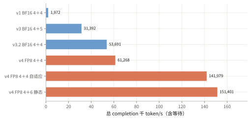

# poor-rl：总吞吐从约两千升到十五万 token/s

BF16 路径达到 53,691 token/s；FP8、大 microbatch 和去掉 KL reference 的短程配方达到 151,401 token/s，训推一致性仍未通过。

<ul class="settings"><li>模型 <b>Qwen3.5-0.8B</b></li><li>设备 <b>H200</b></li><li>主参数和优化器 <b>FP32</b></li><li>吞吐 <b>实际训练 completion token/s</b></li></ul>

## BF16 的主要增益来自并行生成和减少重复计算

总吞吐为实际参加训练的 completion token 总数，除以 step 总墙钟时间，包含等待和权重同步。v0 至 v4 是下面的工程阶段编号。下表从仓库的 <code>INFRA_HISTORY.md</code> 摘取关键阶段；完整行及测量边界见[固定版本原文](https://github.com/guoshaoyang-pku/poor-rl/blob/69a498b9429c6524beda97269f6e49fd98707143/docs/INFRA_HISTORY.md)。

| 阶段 | 计算 | 训练＋rollout H200 | 计时点 n | 中位秒/步 | 总 token/s | 相对 v1 | 等 rollout |
|---|---|---|---:|---:|---:|---:|---:|
| v0 | FP32 | 4＋4 | 9 | 120.17 | 1,607 | 0.81× | 54.7% |
| v1（近似 TRL baseline） | BF16 | 4＋4 | 17 | 113.80 | 1,972 | 1.00× | 84.9% |
| v2 | BF16 | 4＋2 | 4 | 136.38 | 1,551 | 0.79× | 90.9% |
| v3 | BF16 | 4＋5 | 186 | 61.06 | 31,392 | 15.92× | 1.9% |
| v3.1e | BF16 | 4＋5 | 110 | 65.27 | 30,957 | 15.70× | 1.9% |
| v3.2 | BF16 | 4＋5 | 447 | 36.18 | 53,221 | 26.99× | 7.4% |
| v3.2（4＋4对照） | BF16 | 4＋4 | 17 | 35.57 | 53,691 | 27.23× | 6.4% |
| v4（stride统一） | FP8 | 4＋4 | 17 | 32.23 | 61,268 | 31.07× | 4.1% |
| v4（β=0，4＋4自适应） | FP8 | 4＋4 | 3 | 63.53 | 141,979 | 72.00× | 16.5% |
| v4（β=0，4＋6静态） | FP8 | 4＋6 | 3 | 58.01 | 151,401 | 76.78× | 11.3% |

v0→v1：主参数和优化器保持 FP32，训练改用 BF16 autocast。v2→v3：rollout 从多卡共同承载一个副本改成单卡多副本，复用 prompt 前缀，修复连接超时并调整队列和允许的策略年龄。v3.1：恢复并发 judge、补偿裁判延迟、审计丢弃样本并固定 KL reference。v3.2：加入 fast logprob、token 子批、自适应 activation checkpoint 和 rank 负载均衡。

## FP8 配方同时改变了计算、batch 和调度

v4 在前反向矩阵乘使用 FP8，主参数、梯度累加和 Adam 保持 FP32。修复重复量化编译、更新后缓存不刷新、vLLM（rollout serving 框架）的缓存 dtype 和 backward stride；融合 conv＋SiLU，减少 Norm 中间量。

最后两行每卡真实 microbatch=1024、GAS=1、global batch=4096，旧对照为 global batch=1024。保留 GSPO、reward 和 Luna judge，KL 系数 β=0；原先计算冻结 reference logprob 的两张卡改为 rollout，形成 4＋6。自适应方案按等待、队列和策略年龄调整入场组数，保持完整 G32。

这两行只统计预先固定的第 4–6 步，每配置一次。相比最强 BF16 的 2.64×、2.82×包含精度、batch、调度、KL 和卡数变化。历史长 run 的 checkpoint、batch、judge 也不同，4＋5 主线另用一张评测卡。高吞吐来自冻结实验配方，未全部集成进主入口，长期学习收益未验证。

## MFU 是估算，训推差异仍是未通过项

MFU（有用模型计算相对设备峰值的比例）按四张训练卡、含等待估算：BF16 4＋4 约 26.7%，FP8 自适应 4＋4 约 11.2%，4＋6 约 11.8%；后两项纯前反向约 14.4%、14.3%。BF16 用 TRL 通用 FLOPs（浮点运算量）公式，FP8 用捕获算子和共享前缀代理估算，方法与峰值均不同，不能据此判断跨精度 MFU 退化。

零更新、同权重同 token 的一个 128-token 样本，trainer−decode logprob 绝对差 P90=0.1214，未过 0.004 门槛；其余两项对照也未通过。诊断 serving 配置与生产不同，仍需全 batch 验证。4＋6 的 GSPO 下侧实际 clip 为 43.84%，上侧为 0.0081%，尚无阈值调整的学习收益证据。

FP8 KV、MB2048 和跨独立 G32 合并未获预期收益；2:4 稀疏和固定 tile Graph 未启用。下一步减少 conv、norm、循环状态模块、量化写回和整份 batch 广播的成本，并修复共同前向量化规则。

来源：poor-rl 的 [INFRA_HISTORY.md 固定版本](https://github.com/guoshaoyang-pku/poor-rl/blob/69a498b9429c6524beda97269f6e49fd98707143/docs/INFRA_HISTORY.md)，核对于 2026-10-06；[摘录数据与窗口](poor-rl-infra-2026-10-06-data.json)。
