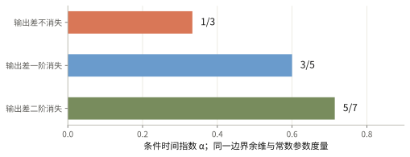
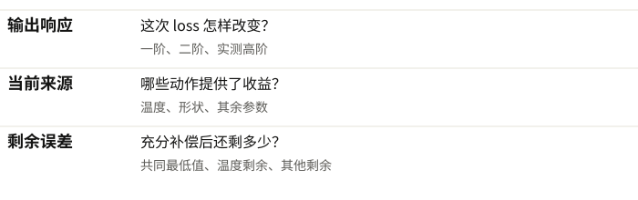
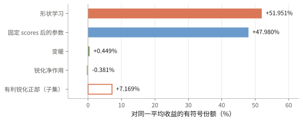
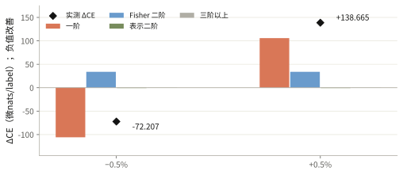
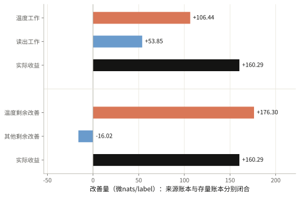
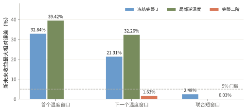
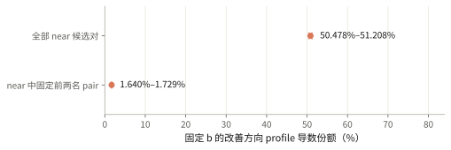
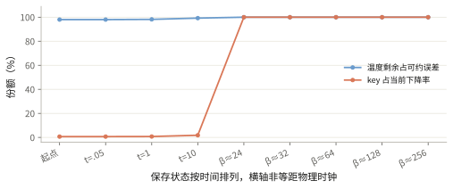

# 我们已拆清部分学习机制，正在检验谁主导长期误差

这个项目从 Liu 的注意力集中理论出发，已给出改变最终任务指数的反例、可预测接管的条件正例，以及真实语言模型的数值账本；自然预训练的长期主导机制仍未定论。

Pythia70M · FineWeb 真实下一 token 标签 · 128 篇 × 224 个标签 · 完整 50304 词表 · 受控任务与自然任务分开

## Liu 把长期慢误差归因于越来越尖锐的注意力

Scaling law 描述模型误差随训练时间、参数规模或数据规模降低的规律。这三个轴需要分别检验。我们主要研究训练时间轴：误差为什么慢慢下降，哪些学习过程决定下降速度。主攻论文是 Liu、Kangaslahti、Gore 的 [Emergent One-Third Scaling Law as Attention Tries to Concentrate](https://arxiv.org/html/2609.32100v1)，本项目核对的是 v1（第一版预印本）。

Attention 用 softmax 在多个 key 位置之间分配概率。把它的 scores 整体放大，会使选择更尖锐。β（逆温度）表示这个放大尺度，a（归一化形状）表示各位置分数的相对结构。Liu 的简化图像是 a 逐渐固定，训练主要增加 β。这里的前两名是两个 key 位置，并不直接对应正确答案。

δ（归一化 gap）是最高和次高 score 之差除以该行标准差。若零附近存在非零连续密度，即小区间的概率约等于密度乘带宽，那么放大 β 后，仍然难以选定的输入落在宽度约 1/β 的边界附近。若两种选择对任务仍有非零影响，最终可约损失就有机会按 1/β 下降。

scores = βa　　→　　边界宽度 ∝ β−1　　→　　B(β) ≈ Cβ−1

B（温度限制留下的任务误差）还要通过实际优化时钟变成时间规律。C（边界系数）由任务和数据决定。g（温度方向的参数度量）描述同样的尺度位移需要多少参数运动。β₀（起点逆温度）保留初始时间修正。在常数 g 的标量梯度流中，β 的增长与 B 的下降共同给出 t 的负三分之一次幂。

dβ/dt ≈ C/(gβ²)　　→　　β³ ≈ β₀³ + 3Ct/g　　→　　B(t) ∝ t−1/3

这条推理需要任务边界可观测、其他参数足够补偿，以及实际动力学近似闭合。有限 teacher 的结论还要求存在“已经很冷、尚未接近目标”的中间区。接近有限目标后出现更快收敛，并不自动违反原条件推导。

<figure></figure>

## 最直接的反例改变了最终任务的幂次

项目先拆开论文里的量词，再用解析构造、普通损失、真实优化和新未来预测逐步检验。最强证据针对三个不同环节。

| 被检验的命题 | 已有证据 | 理论必须补什么 |
|---|---|---|
| 任意原文定义的 reasonable loss 都有逆二次温度导数下界 | 满足字面条件的多项式损失保留静态逆一次，却存在任意远的导数零点和梯度流陷阱。 | 损失或联合 gap 的正则条件，以及导数控制。构造损失不是普通 CE/KL/MSE。 |
| 冷 softmax 与非零零-gap 密度足以给最终任务逆一次 | 普通 MSE/KL 构造中，gate 误差为 β⁻¹，任务误差为 β⁻³。12 条确认 K 轨迹的时间指数为 0.60037–0.60320，接近 3/5。 | 两个候选在平局附近对最终任务的有效响应不能消失。 |
| 静态逆一次足以锁定时间指数 1/3 | 保持同一静态函数，改变原生优化几何，可以得到不同时间律。 | 参数化、优化器历史和相对运动速度必须进入预测。 |

第二个反例最贴近核心机制：两种注意力选项越接近平局，它们提供的任务信息也越相同。Gate 的不确定性继续存在，任务错误却消失得更快。这改变了指数，已经超出只修正常数的程度。随机 generic values 下的逆一次正例仍保留。

反例的适用范围

多项式损失反例针对 Appendix B.4 的全称导数结论。普通最终损失反例针对 gate 误差到下游损失的充分性外推，不能冒称它单独推翻另一个严格分离 gate 概率的定理。12 条轨迹包含参数和步长对照，不是 12 种独立自然任务。自然语言模型长期主导并未由这些构造裁决。

## 不同任务可以有离散指数类，微小扰动会改变接管时间

c（困难边界的余维）表示必须同时接近几个边界条件。m（任务响应消失阶）表示两个 route 的输出差在边界附近以几次幂趋零。在非退化密度、普通平方损失或非退化 Fisher KL 下，静态阶数 p（误差对逆温度的幂次）可为 c+2m。若参数度量按 βʳ 变化、p+r+2>0，且导数与多参数动力学都闭合，时间指数才是下面这个值。

p = c + 2m　　g(β) ∝ βʳ　　α = p/(p+r+2)

对于一条普通边界、常数度量，输出差不消失、一阶消失、二阶消失分别对应 1/3、3/5、5/7。我们已有普通最终损失构造、可学习 value 分支和固定学生架构的交叉实验。它们支持指定结构族的离散端点。中间有限窗口的斜率仍可以连续变化。

<figure></figure>

λ（低阶扰动幅度）可以很小，却把最终尾部拉回 1/3。一个受控交叉任务保留 β⁻¹、β⁻³、β⁻⁵ 三项，提前计算完整系数和时钟。把 λ 除以 4，并保持注册的缩放初态，接管时间预言增加 128 倍，实测为 127.77–127.98 倍。慢项占一半剩余误差时，只承担约 20.77% 的当前下降；达到一半下降还需要约 12 倍的缩放时钟。固定架构、只改 teacher 的后续实验补上了表示变化的混淆。

这些结果适合发展成“任务边界类与扰动交叉”的文章。边界渐近积分和普适类思想已有前作，候选贡献在于普通最终任务、可训练参数、稳定条件与未见接管预测的结合。另一方面，同一几何和固定核中的目标谱可以给连续数据指数。不能据此宣称所有任务指数都量子化。

## 三张账本分别回答响应、当前贡献和剩余误差

Teacher forcing（用同样的真实前缀预测同样的下一 token）固定评价对象。它使不同状态可以直接配对，但没有给出自然文本真实条件概率，也没有给出不可约熵。我们借鉴 RGI（不同模型逐 token loss 差近似保留的现象）工作，把大背景与小学习响应分开，再记录每项的绝对量级、符号、波动和交互。

输出账本解释一次 loss 为什么改变。p₀ 和 pₜ 是起终点输出概率，z₀ 和 zₜ 是相应 logits，eᵧ 是真实标签向量。I（完整 logit 位移的有符号一阶作用）与 Q（输出 KL 曲率代价）满足精确恒等式。Q 为正，不自动等于 Liu 的温度剩余。

ΔL = I + Q　　I = E[(p₀−eᵧ)ᵀ(zₜ−z₀)]　　Q = E KL(p₀ ∥ pₜ) ≥ 0

来源账本沿声明路径积分，回答哪些参数动作提供了当前收益。它区分 score 尺度、归一化形状和固定 scores 后的参数作用。后者包含 attention value 与输出投影，不能称为全部“非 attention”。这些分项带符号，并且依赖路径与坐标。

存量账本则先允许其他参数充分补偿。F（真实标签 CE）依赖温度 b 与允许变化的其他参数 φ。U（固定温度后的最小 CE）是这个补偿问题的最优值。F*（共同 floor）是同一模型集合中的最低 CE。B 是温度剩余，O 是其他参数尚未补偿好的剩余。

U(b) = infφ F(b,φ)　　F* = infb U(b) F−F* = B+O　　B = U−F* ≥ 0　　O = F−U ≥ 0

<figure></figure>

长期主导还要证明 O/B 趋零、路径交互余项相对 B 消失，并用实际时钟预报新未来。一次收益中的小份额、剩余误差中的大份额、无限时间的主导是不同命题。RGI 侧线还发现，共同冻结参考能解释约 96.657%–97.582% 的 raw loss 方差，但更强的优化器差和跨前缀恒定差检验仍有失败。背景相关性不能替代对小机制项的核验。

## 自然语言短窗的收益主要来自一阶作用和分数形状学习

这一组使用 Pythia70M 官方 143000 状态，在 FineWeb 64 篇训练文档上更新全部 76 个参数张量，八步 SGD 的步长为 2×10⁻⁷。在固定 128 篇评价文档上，每篇使用 224 个真实标签与完整 50304 词表。起点 CE 为 3.960422449 nats/label，实测下降 54.928387 微nats/label，按配对文档计算的 95% 区间为 34.5888–75.2680。一个微nats等于 10⁻⁶ nats。

A₁（参数一阶作用）、Q_F（正 Fisher 二阶曲率）、R₂（有符号的 logit 二阶表示响应）、E≥3（三阶以上实测余项）沿起终点参数直线计算。下面的比例以实际平均收益为分母，正贡献表示降低 CE。

ΔL = A₁ + Q_F + R₂ + E≥3

| 分阶项 | 均值，微nats/label | 对收益的有符号贡献 |
|---|---:|---:|
| 参数一阶作用 | −56.164477 | +102.250% |
| 正 Fisher 二阶曲率 | +1.233747 | −2.246% |
| 表示二阶响应 | −0.059072 | +0.108% |
| 三阶以上余项 | +0.061415 | −0.112% |

表示二阶的文档标准差约 5.051 微nats，均值区间跨零。高阶余项的文档均方根为 0.518 微nats，约为平均收益的 0.944%。因此小均值不意味着每篇文档都可忽略。这个短窗的分阶很准确，跨官方 checkpoint 的大位移中，固定起点近似已经失效。

<figure></figure>

来源积分中，形状学习占 51.951%，固定 scores 后参数作用占 47.980%，变暖占 0.449%，锐化净作用为 −0.381%。所有有利锐化累计约 7.169%，有害部分更多。固定近打平集合以起点 δ≤0.25 定义，覆盖约 49.02% 的常规行，按交互平均分摊的有限归因规则占约 51.35% 的收益，其中 shape 工作远大于径向尺度工作。近打平有任务作用，并不能单独证明纯锐化主导。

当前分解的数值边界

独立实现核对原温度与自然端点，最大差约 4.21×10⁻¹³ nats。全参数自然直线与把 scores 独立输入的直线，是两条不同路径，其分阶系数不互换。来源实验中 17/128 篇进行了分项积分细化，剩余 111 篇的总闭合不能排除分项抵消。固定 near 集合的完整实验保留跨平台端点、部分 AD 和原积分门槛失败。补充复核支持所展示量级，原整轮资格仍未全过。这些是既有评价池的数值诊断，不是新语料的独立总体确认，也不是官方 AdamW 长期历史。

## 小温度干预可以量出每阶，但更尖锐并不总是更好

在同一个 143000 自然状态附近冻结模型，用 b（score 乘数）作小幅干预，b=1 是自然尺度。全六层同时改变 ±0.5%，分别得到下面的响应。表中负号表示 CE 降低，单位为微nats/label。

| score 改变 | 一阶 | Fisher 二阶 | 表示二阶 | 三阶以上 | 实际 ΔCE |
|---|---:|---:|---:|---:|---:|
| −0.5% | −105.804 | +33.927 | −0.705 | +0.375 | −72.207 |
| +0.5% | +105.804 | +33.927 | −0.705 | −0.360 | +138.665 |

<figure></figure>

在 ±0.25% 与 ±0.5% 中，二阶近似的平均余项约占净响应 0.072%–0.519%。仅最后层 ±2% 时，变暖改善约 39.431 微nats，锐化恶化约 38.672 微nats。全层变暖的改善区间仍跨零，不能直接宣布总体有益。

小温度区是看到原 ±1%/2% 失败后另登记的补充，不能称完全盲选。它量出冻结状态的局部敏感度，没有将人工温度收益当成真实训练占比，也没有提供长期剩余误差。

## 受限自然模型已量出共同最低值，温度份额随补偿与时钟改变

另一组使用官方 32000 状态、FineWeb 128 篇训练文档和相同标签数、完整词表。允许最后层八个 head 的 K weight/bias 沿官方射线改变尺度，完整读出层在官方中心的 5% 范数球内补偿，其他参数冻结。温度范围为 0.5–2。这是声明过的有限模型集合，其 floor 不等于整网最优或自然文本熵。

共同 floor 已收紧到 2.129327063–2.129590128 nats/label，区间宽度约 0.000263。在官方未补偿读出的同轨迹末态，温度剩余 B 约为 0.008726–0.009046，其他剩余 O 约为 1.879800–1.879857；B 份额不超过 0.479%。若先把读出补偿好，O 大幅降低，B 份额就可以超过 99%。这是不同初始化，不能写成实际训练已观察到自动接管。

原生欧氏几何下，温度尺度的参数度量约为 147534.322，读出度量为 1。在一个共同日历的联合短窗里，温度只移动约 2.06×10⁻⁸，工作小于登记数值预算。显式加速温度相对运动约 590137 倍的对照里，score 尺度只增加 0.9833%，温度工作却达到当前收益的 66.406%。这证明时钟改变贡献，不能把显式加速叫原生预训练。

<figure></figure>

在该显式时钟路径，实际收益为 160.287 微nats，温度工作为 106.440，读出工作为 53.847。温度 profile（每个温度下充分补偿的最优 CE）改善为 175.359–177.319 微nats，读出滞后反而增长 15.052–17.051 微nats。来源工作与存量减少之间的差已直接量出，不能令它们相等。

## 新未来预测与候选对分解开始区分具体机制

J（冻结起点的完整 Jacobian）预测只保留 logits 对参数的一阶响应。完整参数二阶预测增加表示二阶和温度/读出混合响应。二者在实际未来执行前封存，用自己的状态递推。受限自然模型的两个较宽温度窗口中，固定 J 与局部逆温度预测失败；加入二阶后，下一个新窗口的收益误差约 1.63%，通过 5% 门槛。

<figure></figure>

较小的联合窗口里，J 误差约 2.48%，二阶误差约 0.0346%，两者都通过。这说明所需状态随窗口改变。它没有把 J 宣判永久失效，也没有把二阶成功称作已经解释原 1/3 渐近。原 raw-score 独立二阶 AD 有失败，后续等价 score 平移的稳定化复核通过，两种资格分开保留。

最新静态诊断在同一个 b≈1.18734 上，把允许读出补偿后的温度导数分到候选对。Near（近打平行）由起点 δ≤0.25 冻结，top2（起点固定前两名候选对）只是全部 pair 的一项。经精化与条件 FP64 区间认证，near 占总改善方向导数 50.478%–51.208%，top2 只占总量 1.640%–1.729%；其余 near pair 承担主要净响应。完整响应包含真实标签、value、后续 norm 和读出。这里没有将当前 argmax 充当正确 teacher。

<figure></figure>

同一 score 几何下，读出补偿甚至会使固定 top2 的 signed 温度作用反号。因此 gap 密度、候选内容差和真实任务边界之间的桥必须直接计算。上述百分比是固定温度的局部 profile 导数份额，不是 SGD 工作、B 存量或长期指数份额。原宽导数界、精化超时和保存错误都保留，精度 successor 不回填原失败。

## 四个流派需要交出同一干预下的不同预测

这些流派存在重叠。一次幂律拟合不能给它们投票。我们已把每派改成具体的、能失败的预测：先冻结它需要的状态、坐标和时钟，再检验同任务的新干预。

| 流派及它保留的状态 | 本项目已有裁决 | 仍然保留的条件分支 |
|---|---|---|
| 普适边界：任务加权边界阶、补偿和实际时钟 | 裸 gate→task 迁移与无条件导数结论失败，指定类有完整时间正例。 | 边界非退化、快项弛豫与原生几何明确的条件机制。 |
| 数据/曝光：不同 token 的学习事件和出现频率 | 同宽事件与 mean-exposure 的普遍充分性版本失败，顺序和异质谱仍需检验。 | 工业 per-token 描述没有被整篇推翻；事件谱可由边界或核产生。 |
| 分辨率：有限规模只能分辨有限结构 | 维数单独决定必要指数的强版本已被解析反例否定。 | 原 generic/有效维数饱和猜想、Lipschitz 上界、带目标谱的分辨率理论未全被反驳。 |
| NTK（神经切线核）：起点 Jacobian、核谱和任务投影 | 指定有限初始核的长期容量在受控任务上失败，小自然窗口仍能成功预测。 | 无限宽定理、随训练演化的核和含目标谱的模型。 |

分辨率支线有更扎实的区分：同一圆周、核和有界正则类内，密集目标谱改变，独立样本数轴的长期对数指数可连续经过 4–4.5，随机参数轴仍为三次量级。另一个非线性全交互解析任务只需有限条一维 ridge，就能达到参数规模的负四次方误差。它否定无条件维数必要律，但仍是非 generic 结构，不能宣布整个分辨率流派死亡。比上界收敛更快也不会违反上界。

公开文献与本地结果来源

边界机制：<a href="https://arxiv.org/html/2609.32100v1">Liu 第一版</a>。数据学习谱：<a href="https://arxiv.org/html/2606.29858v2">Wang 第二版</a>。维数分辨率：<a href="https://jmlr.org/papers/v23/20-1111.html">Sharma–Kaplan</a>。谱分辨率：<a href="https://arxiv.org/html/2102.06701v2">Bahri 第二版</a>。NTK：<a href="https://arxiv.org/abs/1806.07572v4">Jacot 第四版</a>，<a href="https://proceedings.mlr.press/v119/bordelon20a.html">核学习曲线</a>，<a href="https://arxiv.org/html/2402.01092v4">动力学谱</a>。本地反例、任务类、时钟、分阶与 profile 的数值入口和文件校验值保存在同行的<a href="scaling-project-overview-20261007.evidence.json">证据登记</a>；它仅导出本报告使用的读数，未经重新训练。

## 条件正例已能预测接管，最终目标是在自然语言中完成同等解释

项目同时保留对 Liu 有利的证据。完整 18 参数 K/V 的受控平方损失任务，在任务边界可观测、形状稳定、value 快弛豫和原生度量明确时，提前计算的曲线通过了新未来门槛，硬 teacher 的晚期指数接近 1/3。同一个任务里，完整有限初始核存在正 floor，真实非线性模型继续下降到它以下。

另一个普通二分类 CE 任务给定完整 teacher 概率，四个 key/value 参数都自由更新。真实不可约熵为 0.365333855 nats，起点温度剩余为 0.006943927、其他剩余为 0.000140616，边界系数为 0.113352676、原生温度度量为 2。起点 B 占可约剩余 98.02%，key 只占当前下降 0.698%；后续其他剩余消退后，key 接管几乎全部下降。冻结有限温度 profile 和时钟的未来 KL 最大相对误差约 2.277×10⁻⁶。

<figure></figure>

这个例子让“当前贡献小，但未来可能主导”成为可以预测的命题。它的二候选 normalized gap 恒为 2，不覆盖原文零-gap 密度条件。它不是自然语言结果。两种条件正例验证各自任务，不能把数字拼成自然模型的完整解释。

我们预期最终交付一个可以复算的自然语言机制模型：固定评价前缀和真实标签，逐项给出绝对量级、符号、逐文档波动、交互和余项；在同一训练轨迹上，量准温度剩余与其他剩余的共同 floor；再用冻结的系数与原生时钟预测未见的 loss、温度运动和接管时刻。若温度项未接管，也要明确指出它缺少任务响应、被别的慢项压过，还是优化几何使它不可见。

| 最终解释必须回答 | 可以交付的证据 |
|---|---|
| 近打平是否真的留下未解决任务误差？ | 正任务边界系数、允许补偿后的剩余，以及候选对的作用区间。 |
| 当前学习与未来剩余是否属于同一机制？ | 同轨迹的来源→存量差、补偿滞后、交互和 tail-window 变化。 |
| 何时成为主导，换优化器后怎样改变？ | 其他剩余与温度剩余的比值、实际参数度量和事前接管预报。 |
| 哪个流派解释得更完整？ | 同任务、同预算的曝光、几何、表示与规模干预，比较未见 token 向量和未来曲线。 |

自然原生慢时钟实验已经登记，但本报告采用的本地材料还没有完整的新未来、来源、存量和连续流资格，不能提前宣布成功。整网开放后的共同 floor、跨模型与独立语料验证仍有责任。文章级近期成果是任务边界类、扰动交叉和来源/存量区分；完整自然预训练解释是后续研究目标，不是已经获得的结论。

怎样理解可靠性与公开范围

解析反例承担全称命题的证伪责任。保存数组与独立 AD 复核承担数值实现责任。新未来预测承担有限机制模型的预测责任。检查数量不能当独立实验数量，固定语料的文档区间不能当跨训练或自然语料总体确认。FP64 优化区间依赖声明误差模型，不是全部向外取整的实数证明。公开包包含总览、图与最小数值登记；没有发布自然文本原片段、模型权重、凭证、集群地址或原始私有仓库历史。原逐轮 Markdown 和失败证据在本地保持。

来源：已保存逐轮结果与独立审核，读数截至 2026-10-07；新报告只重绘、核对与汇总既有结果。
